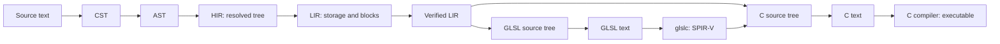

# Compiler architecture

Resin's compiler is a sequence of explicit languages and passes. Each phase is an
unpublished Cargo workspace crate; public data describes its output, and private
implementation modules construct it. The `resin` crate is the driver and
re-exports the phase crates for library users.

The root manifest is a virtual workspace. All native Rust packages live under
`crates/`: the driver in `resin`, the native C ABI in `resin-runtime`, the language server
in `resin-lsp`, and the compiler phases alongside them. Directories match their Cargo
package names, including the `resin-` prefix. Each package owns its source and
tests. Shared Resin examples, the standard library, and documentation stay at the
repository root. `resin` is the default member, so `cargo run -- examples/eg001.resin`
still works there; use `--workspace` to build or test every native package.

`crates/tree-sitter-resin` keeps the grammar, generated parser, queries, JavaScript
tooling, and Rust bindings together as one package. `editors/zed` is an independent
Cargo workspace for the WASI extension and its language queries. Its manifest pins
a repository commit and the grammar's path; update both when relocating the grammar.



These arrows show data flow. Cargo dependencies point toward the languages a
pass consumes. Every phase uses `resin-common`; it has no phase dependencies.

| Crate | Direct compiler dependencies besides `common` | Public purpose |
| --- | --- | --- |
| `resin-cst` | generated `tree-sitter-resin` grammar | Concrete syntax documents, reparsing, syntax queries, formatting |
| `resin-ast` | `cst` | Source AST, parsing diagnostics, import loading |
| `resin-hir` | `ast`, `cst` | Resolved tree, source checking and elaboration, opaque editor analysis |
| `resin-lir` | `hir` | Typed stack instructions, storage and control-flow lowering |
| `resin-lir-verifier` | `lir` | Verification and immutable certificates |
| `resin-codegen` | `lir`, `lir-verifier` | C/GLSL source trees, target lowering, printing |

The HIR dependency on CST supports editor queries at a syntax position. Its public
language uses only shared source identities and concrete types. LIR lowering never
receives CST, AST, source namespaces, or an inference solver. Codegen consumes the
LIR certificate; it cannot reach the checker's private state.

All workspace packages have `publish = false`. Path dependencies are declared centrally
in the workspace manifest. Keep `common` small: source locations and diagnostics,
resolved types and values, concrete operation and layout rules, and tiny utilities.
It is not a home for phase-specific state moved to avoid a dependency cycle.

## A consistent reading path

For each phase, read `language.rs`, then `lower`, then `print`. The target languages
follow the same arrangement inside `codegen/c` and `codegen/glsl`. A module's
`lib.rs` (or a target's `mod.rs`) lists its public API. Most implementation modules
are private even when their functions must be shared internally.

| Phase | Language definition | Incoming pass | Printing |
| --- | --- | --- | --- |
| CST | [Document](../crates/resin-cst/src/language.rs) | [incremental parsing](../crates/resin-cst/src/lower.rs) | [source formatting](../crates/resin-cst/src/print.rs) |
| AST | [source nodes](../crates/resin-ast/src/language.rs) | [CST → AST](../crates/resin-ast/src/lower.rs) | [S-expressions](../crates/resin-ast/src/print.rs) |
| HIR | [resolved nodes](../crates/resin-hir/src/language.rs) | [AST → HIR](../crates/resin-hir/src/lower/mod.rs) | [typed S-expressions](../crates/resin-hir/src/print.rs) |
| LIR | [instructions and blocks](../crates/resin-lir/src/language.rs) | [HIR → LIR](../crates/resin-lir/src/lower/mod.rs) | [S-expressions](../crates/resin-lir/src/print/mod.rs) |
| C | [C source tree](../crates/resin-codegen/src/c/language.rs) | [verified LIR → C](../crates/resin-codegen/src/c/lower/mod.rs) | [C text](../crates/resin-codegen/src/c/print.rs) |
| GLSL | [shader source tree](../crates/resin-codegen/src/glsl/language.rs) | [verified LIR → GLSL](../crates/resin-codegen/src/glsl/lower/mod.rs) | [GLSL text](../crates/resin-codegen/src/glsl/print.rs) |

Prefer small functions named for the operation they perform. The
[Bitwise project](https://github.com/pervognsen/bitwise) is a style reference for
visible data, direct construction, and code that teaches its implementation.
Resin uses idiomatic Rust and meaningful pass boundaries; an exhaustive language
dispatch may remain long when splitting it would obscure the cases.

## What each boundary guarantees

CST pairs source text with a Tree-sitter tree. `Document::reparse` may reuse a
previous document, and syntax-only queries and formatting need no semantic state.
AST lowering converts that syntax into source constructs. The recovering API keeps
holes and diagnostics; the strict API returns a file only when syntax is valid.
AST module loading orders dependencies and resolves paths, without executing imports.

HIR construction has three internal steps:

1. Declare names and check expressions into a private tree with inference types.
2. Solve function dependency groups and resolve every annotation and expression type.
3. Elaborate into public HIR, removing source-only lookup and syntax.

The private checking tree retains lexical context for declaration visibility;
those contexts never cross into public HIR. Method calls become ordinary calls
to resolved function IDs with explicit receiver adaptation and argument packing.
Compiler-provided methods become intrinsic operations. Short-circuit operators
become `If` nodes, field projections are resolved, numeric literals become values,
and layout queries become constants whose operands cannot execute. Type aliases
and method namespaces disappear. Nominal identities and destruction hooks remain
in the shared type table because later phases need them.

HIR remains a tree: `If`, `While`, blocks, matches, Result propagation, places,
and values retain their structure. LIR lowering assigns storage to binding IDs,
checks definite initialization, and makes evaluation, ownership cleanup, and
control flow explicit. Thus a HIR module can still fail storage/initialization
checks during LIR lowering. Every LIR function reserves local zero for its unary
parameter, including unit, tuples, and foreign declarations.

The separate verifier checks arbitrary LIR, including instruction operands,
block entry stacks, returns, nominal layouts, shader signatures, and drop hooks.
`VerifiedModule` owns the module and analysis behind private fields. `view()`
borrows an immutable certificate for that exact module. `into_module()` consumes
the certificate and returns ordinary LIR; editing it requires verification again.
Target lowering accepts a certificate rather than trusting that a caller verified
some earlier version of the module.

C lowering chooses the ABI, runtime operations, and native entry wrapper. GLSL
lowering resolves reachable functions, checks device restrictions, and represents
local addresses and direct functions symbolically. Both produce owned target
trees. These describe translation units, functions, blocks, and control-flow edges;
leaf strings already contain target syntax for declarations and expressions. They
are deliberately limited generated-source languages, rather than full C or GLSL
parser ASTs. Printers only format their own target language, including parallel
edge copies. They need no LIR, verifier analysis, or source metadata.

## Calling the passes

The smallest host pipeline uses just the public phase APIs:

```rust
use resin::{ast, c, cst, hir, lir, lir_verifier};

fn main() -> Result<(), Box<dyn std::error::Error>> {
    let syntax = cst::Document::reparse(
        "export { main }; def main() -> int = { 42 };".into(), None,
    );
    let ast = ast::lower::generate(&syntax)?;
    let hir = hir::lower::generate(&ast)?;
    let lir = lir::lower::generate(&hir)?;
    let checked = lir_verifier::VerifiedModule::new(lir)?;
    let target = c::lower::generate(checked.view(), "main", &[])?;
    let source = c::print::module(&target);
    Ok(())
}
```

For imports, use `ast::load_with` and `hir::lower::generate_program`.
`hir::lower::analyze_program` returns a `Compilation` with diagnostics and opaque
editor analysis even on failure. The `Analysis` query methods accept a small
`Documents` interface rather than exposing scopes to the editor adapter.
`lir::lower::analyze` collects errors across functions; `generate` returns the
first error. Convenience C/GLSL `emit` functions verify, lower, and print for
callers holding ordinary LIR.

The driver in [compiler/passes.rs](../crates/resin/src/compiler/passes.rs) sequences HIR,
LIR, and verification. [compiler/build.rs](../crates/resin/src/compiler/build.rs) and
[compiler/shaders.rs](../crates/resin/src/compiler/shaders.rs) coordinate target generation
and the [toolchain](../crates/resin/src/toolchain.rs), which owns external processes and caches.
No language crate imports the driver, invokes native compilers, or executes code.

## Sessions and incrementality

The architecture supports both a long-lived editor and a single CLI invocation.
`Session` retains source overlays, parsed documents, import dependencies, and
immutable snapshots. Repeated analysis without changes reuses a snapshot; edits
incrementally reparse affected CST documents and invalidate dependent entries.
Semantic checking currently reruns the affected entry's import closure. It is
not an incremental constraint solver or a per-function incremental backend.

A snapshot exposes recovered ASTs, strict AST/HIR products, diagnostics, and
verified LIR. A later pass failing does not invalidate an earlier successful
product. Old snapshots remain usable when the session advances. The native
artifact cache is separate from this analysis cache. The CLI uses the same
session implementation for one build/run request; the language server retains
it across edits.
