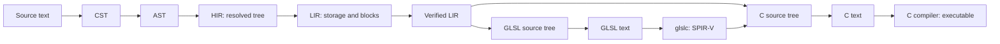

# Compiler architecture

Resin's compiler is a sequence of explicit languages and passes. Each phase is an
unpublished Cargo workspace crate. Public data describes its output; a small set
of public operations constructs, prints, or queries that data. Each crate lists
its full public interface in `lib.rs`; implementation modules stay private.

The root manifest is both a package and a workspace. Root `src/` contains the
`resin` CLI: `resin FILE` builds and runs, `resin FILE --output PATH` builds an
executable, `resin --format DIR` formats source, and `resin --lsp DIR` serves the
Language Server Protocol. There is one executable to distribute.

Reusable libraries live under `crates/`, with directory names matching their Cargo
package names. `resin-compiler` owns pass sequencing, source loading, sessions, and
retained analysis. `resin-platform-toolchain` owns process discovery, native builds,
and artifact caches. The `resin-lsp` library adapts compiler queries to the protocol;
no library depends on the root CLI. The native C ABI lives in `resin-runtime`.

Crates own their isolated tests; root `tests/` exercises the complete executable and
cross-crate behavior. Examples, the standard library, and documentation stay at the
repository root. The root package is the default member, so
`cargo run -- examples/eg001.resin` works there. Use `--workspace` to build or test
all native packages.

`crates/tree-sitter-resin` keeps the grammar, generated parser, queries, JavaScript
tooling, and Rust bindings together as one package. `editors/zed` is an independent
Cargo workspace for the WASI extension and its language queries. Its manifest pins
a repository commit and the grammar's path; update both when relocating the grammar.



These arrows show data flow. Cargo dependencies point toward the languages a
pass consumes. Every phase uses `resin-common`; it has no phase dependencies.

| Crate | Direct compiler dependencies besides `common` | Public purpose |
| --- | --- | --- |
| `resin-cst` | generated `tree-sitter-resin` grammar | Concrete syntax documents, reparsing, syntax queries, formatting |
| `resin-ast` | `cst` | Source AST, syntax recovery, and parsing diagnostics |
| `resin-hir` | `ast`, `cst` | Resolved tree, source checking and elaboration, opaque editor analysis |
| `resin-lir` | `hir` | Typed stack instructions, storage and control-flow lowering |
| `resin-lir-verifier` | `lir` | Verification and immutable certificates |
| `resin-codegen` | `lir`, `lir-verifier` | C/GLSL source trees, target lowering, printing |
| `resin-platform-toolchain` | none | Explicit process inputs, resolved tools, locked native artifacts |
| `resin-compiler` | all phases and `platform-toolchain` | Source loading, pass sequencing, sessions, retained compilations |
| `resin-lsp` | `compiler`, `cst` | Compiler queries and formatting over LSP |

The HIR dependency on CST supports editor queries at a syntax position. Its public
language uses only shared source identities and concrete types. LIR lowering never
receives CST, AST, source namespaces, or an inference solver. Codegen consumes the
LIR certificate; it cannot reach the checker's private state.

All workspace packages have `publish = false`. Path dependencies are declared centrally
in the workspace manifest. Keep `common` small: source locations and diagnostics,
resolved types and values, concrete operation and layout rules, and tiny utilities.
It is not a home for phase-specific state moved to avoid a dependency cycle.

## A consistent reading path

For each phase, start with `lib.rs`: language data appears beside the operations
that accept the preceding language and produce this one. Follow an operation into
private `lower` or `print` only when its implementation matters. Codegen's entry
point contains both C and GLSL definitions, with separate private target modules.
Common's entry point lists curated source, diagnostic, and concrete-type namespaces.
Language-specific builders and solver state stay behind these facades.

| Phase | Language definition | Incoming pass | Printing |
| --- | --- | --- | --- |
| CST | [Document](../crates/resin-cst/src/lib.rs) | [incremental parsing](../crates/resin-cst/src/lower.rs) | [source formatting](../crates/resin-cst/src/print.rs) |
| AST | [source nodes](../crates/resin-ast/src/lib.rs) | [CST → AST](../crates/resin-ast/src/lower.rs) | [S-expressions](../crates/resin-ast/src/print.rs) |
| HIR | [resolved nodes](../crates/resin-hir/src/lib.rs) | [AST → HIR](../crates/resin-hir/src/lower/mod.rs) | [typed S-expressions](../crates/resin-hir/src/print.rs) |
| LIR | [instructions and blocks](../crates/resin-lir/src/lib.rs) | [HIR → LIR](../crates/resin-lir/src/lower/mod.rs) | [S-expressions](../crates/resin-lir/src/print/mod.rs) |
| C | [C source tree](../crates/resin-codegen/src/lib.rs) | [verified LIR → C](../crates/resin-codegen/src/c/lower/mod.rs) | [C text](../crates/resin-codegen/src/c/print.rs) |
| GLSL | [shader source tree](../crates/resin-codegen/src/lib.rs) | [verified LIR → GLSL](../crates/resin-codegen/src/glsl/lower/mod.rs) | [GLSL text](../crates/resin-codegen/src/glsl/print.rs) |

Prefer small functions named for the operation they perform. The
[Bitwise taste guide](bitwise.md) explains the style reference through concrete
examples of visible data, direct construction, and code that teaches its implementation.
Resin uses idiomatic Rust and meaningful pass boundaries; an exhaustive language
dispatch may remain long when splitting it would obscure the cases.

## What each boundary guarantees

CST pairs source text with a Tree-sitter tree. `Document::reparse` may reuse a
previous document, and syntax-only queries and formatting need no semantic state.
AST lowering converts that syntax into source constructs. The recovering API keeps
holes and diagnostics; the strict API returns a file only when syntax is valid.
The compiler's private loader resolves paths and orders AST modules into a `Program`,
without executing imports. AST generation itself performs no source I/O.

HIR construction has three internal steps:

1. Declare names and check expressions into a private tree with inference types.
2. Solve function dependency groups and resolve every annotation and expression type.
3. Elaborate into public HIR, removing source-only lookup and syntax.

The private checking tree retains lexical context for declaration visibility;
those contexts never cross into public HIR. Method calls become ordinary calls
to resolved function IDs with explicit receiver adaptation and argument packing.
Compiler-provided methods become intrinsic operations. Short-circuit operators
become `If` nodes, field projections are resolved, numeric literals become values,
and layout queries become constants whose operands cannot execute. Type aliases
and method namespaces disappear. Nominal identities and destruction hooks remain
in the shared type table because later phases need them.

HIR remains a tree: `If`, `While`, blocks, matches, Result propagation, places,
and values retain their structure. LIR lowering assigns storage to binding IDs,
checks definite initialization, and makes evaluation, ownership cleanup, and
control flow explicit. Thus a HIR module can still fail storage/initialization
checks during LIR lowering. Every LIR function reserves local zero for its unary
parameter, including unit, tuples, and foreign declarations.

The separate verifier checks arbitrary LIR, including instruction operands,
block entry stacks, returns, nominal layouts, shader signatures, and drop hooks.
`VerifiedModule` owns the module and analysis behind private fields. `view()`
borrows an immutable certificate for that exact module. `into_module()` consumes
the certificate and returns ordinary LIR; editing it requires verification again.
Target lowering accepts a certificate rather than trusting that a caller verified
some earlier version of the module.

C lowering chooses the ABI, runtime operations, and native entry wrapper. GLSL
lowering resolves reachable functions, checks device restrictions, and represents
local addresses and direct functions symbolically. Both produce owned target
trees. These describe translation units, functions, blocks, and control-flow edges;
leaf strings already contain target syntax for declarations and expressions. They
are deliberately limited generated-source languages, rather than full C or GLSL
parser ASTs. Printers only format their own target language, including parallel
edge copies. They need no LIR, verifier analysis, or source metadata.

## Calling the passes

The smallest host pipeline uses just the public phase APIs:

```rust

fn main() -> Result<(), Box<dyn std::error::Error>> {
    let syntax = resin_cst::Document::reparse(
        "export { main }; def main() -> int = { 42 };".into(), None,
    );
    let ast = resin_ast::generate(&syntax)?;
    let hir = resin_hir::generate(&ast)?;
    let lir = resin_lir::generate(&hir)?;
    let checked = resin_lir_verifier::VerifiedModule::new(lir)?;
    let target = resin_codegen::generate_c(checked.view(), "main", &[])?;
    let source = resin_codegen::print_c(&target);
    assert!(source.contains("main"));
    Ok(())
}
```

For file imports and unsaved buffers, use `resin_compiler::Session::analyze`.
An in-memory caller may construct an `resin_ast::Program` in dependency order and call
`resin_hir::generate_program`. `resin_hir::analyze_program` returns a `CheckedProgram` with
diagnostics and opaque editor analysis even on failure. The `Analysis` query
methods accept a small `Documents` interface; source scopes remain private.
`resin_lir::analyze` collects errors across functions; `resin_lir::generate` returns the first.
Codegen's `emit_c` and `emit_glsl` conveniences verify, lower, and print ordinary LIR.

The driver in [passes.rs](../crates/resin-compiler/src/passes.rs) sequences HIR,
LIR, and verification. [build.rs](../crates/resin-compiler/src/build.rs) and
[shaders.rs](../crates/resin-compiler/src/shaders.rs) coordinate target generation.
The [toolchain facade](../crates/resin-platform-toolchain/src/lib.rs) accepts explicit
`Environment` inputs, resolves an opaque `Toolchain`, and returns an `Executable`
that retains its build-cache lock through copying and execution.
No language crate imports the driver, invokes native compilers, or executes code.

## Sessions and incrementality

The architecture supports both a long-lived editor and a single CLI invocation.
`Session` retains source overlays, parsed documents, import dependencies, and
immutable `Compilation` results. Repeated analysis without changes reuses a result;
edits incrementally reparse affected CST documents and invalidate dependent entries.
Semantic checking currently reruns the affected entry's import closure. It is
not an incremental constraint solver or a per-function incremental backend.

A `Compilation` represents the retained work for one entry and its imports. It
exposes diagnostics, source queries, recovered AST files, and successful AST, HIR,
and LIR products. A failed later pass preserves the earlier completed products.
Private analysis data owns the syntax documents and HIR's opaque editor facts;
callers use `definition`, `hover`, and `completions` without accessing source scopes.
Old compilations remain usable when the session advances.

The name distinguishes the whole retained analysis from a language `Module`, such
as a HIR or LIR module. Native artifact caching is separate from this analysis
cache. The CLI uses one session for its invocation; the LSP library retains one
across edits, inside the same `resin` executable.
