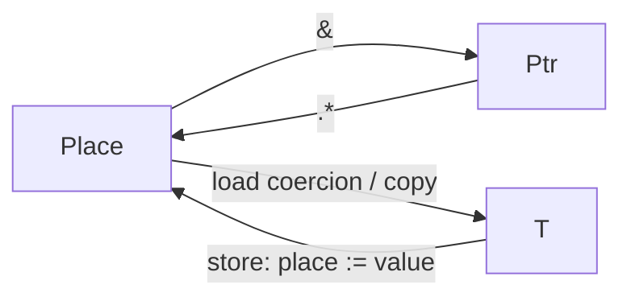

# Lifetimes, places, and shared ownership

`Place<T>` denotes addressable storage inside the compiler. It is not a user-visible
type. Reading a place for a value consumer performs a compiler-generated copy;
assignment stores a value in a place, and address formation preserves its location.



Variables, pointer dereferences, and fields projected from places follow this
model. Array and span indexing returns `Ptr<T>`, so user-defined indexing wrappers
can expose the same interface. `items(i).*` is the element's place.
Shared ownership builds on these rules by retaining on copy and releasing on drop.

Resin keeps ownership explicit in its types. `struct` declares an ordinary value;
`Arc<T>` owns a shared heap allocation containing a `T`, and `Weak<T>` observes that
allocation without keeping its payload alive. All values support compiler-defined
copying. There is no `object`, `class`, `new`, ownership annotation, static move
checking, borrow checker, user-defined `Copy`/`Clone` trait, or move callback.

## Reads copy; expression composition transfers

Using a variable, field, or pointee as a value copies its contents. Address formation
and assignment destinations preserve the place instead. Indexing an array preserves
its storage address; it does not copy the array. The current indexing API returns
`Ptr<T>`, so `items(i).*` requests an element value and `items(i).* := x` addresses
the element for assignment.

`Place<T>` is compiler terminology, not a source-level type. Variables denote places;
`p.*` produces the place addressed by `Ptr<T>`. Field projection from a place preserves
its address through nested access, including implicit dereferencing in `p.field`.
A value consumer requests a compiler-generated copy, while `&` yields the place's
pointer. Indexing returns a pointer so user-defined wrappers have the same interface:

```resin
def at(items: Span<int>, index: ulong) -> Ptr<int> = { items(index) };
// Inside a function:
at(items, 0L).* := 42;
var copied = at(items, 0L).*;
var address = &at(items, 0L).*;
```

A function or type application consumes the resulting argument value. Infix operators are builtin function
applications and follow the same rule. Tuple, record, and array constructors consume
their initializers directly into their fields or elements. A fresh result can be
bound to a local, returned, or passed onward without an additional copy and drop.
Compiler-generated temporaries do not change these semantics.

```resin
var y = x;                  // Copy x, then transfer that result into y.
f(make_t());                // Transfer the fresh result into f's parameter.
f(x);                       // Copy x, then transfer the copy into f's parameter.
a + b                       // Copy a and b; the operator consumes its operands.
Pair { a = make_t(), b = x } // Transfer make_t()'s result; copy x into b.
Arc<T>(make_t())             // Transfer the fresh result into shared storage.
Arc<T>(x)                   // Copy x, then transfer the copy into shared storage.
```

Function parameters own their argument values and receive ordinary scope cleanup.
Returning a fresh expression transfers its result to the caller. Returning a named
parameter or local reads and therefore copies that value; the original still receives
cleanup. Names remain usable after reads. Assignment expressions preserve their
assigned value, so the stored value and the expression result are separate copies;
reassignment destroys the previous initialized destination.

| Type | Copy behavior |
| --- | --- |
| Primitive, `Ptr<T>`, `Span<T>` | Copy the value, address, or pointer/length pair |
| `Arc<T>` | Retain the same allocation's strong count; do not copy `T` |
| `Weak<T>` | Retain weak ownership bookkeeping |
| Struct or tuple | Recursively copy its fields |
| Array | Recursively copy its elements |
| `Option`, `Result`, union | Recursively copy the active payload |

`Ptr<Arc<T>>` points to an Arc handle; `Ptr<T>` points to a `T`. Neither `Ptr<T>`
nor `Span<T>` owns or destroys its pointee. Copying an Arc never copies its pointee.
Reference-count operations mean generated copying is not necessarily bitwise copying.

## Construction and methods

Both forms below consume their initializer without separately destroying a temporary
payload, just as ordinary function calls consume their argument values:

```resin
var shared = Arc<Resource> { handle = acquire_native_handle() };
var another = Arc<Resource>(make_resource());
```

A type alias for `Arc<T>` supports the same construction syntax. This is value
transfer, not a promise that a temporary's machine address is preserved;
self-referential stack values are not pinned.

An `impl` belongs to a struct declared in the same module:

```resin
struct Resource { handle: Ptr<ubyte> };
impl Resource {
    def make() -> Arc<Resource> = {
        Arc<Resource> { handle = acquire_native_handle() }
    };
    def address(self: Ptr<Resource>) -> Ptr<ubyte> = { self.handle };
    def drop(self: Ptr<Resource>) = { release_native_handle(self.handle); };
}
```

`self` as the first parameter declares an instance method. Its type is `T`, `Ptr<T>`,
or `Arc<T>`. Value receivers follow the ordinary copy/transfer rule; pointer receivers
use the receiver's address. Associated functions have no `self`. Method signatures
currently require explicit types; omitted results mean unit. There are no traits,
interfaces, inheritance, or dynamically dispatched methods.

`drop(self: Ptr<T>) -> ()` is a compiler-invoked hook. Calling it directly is rejected.
The hook runs before automatic destruction of fields in reverse declaration order.
It must handle fallible cleanup locally. A wrapper releases its native handle in the
hook and lets generated cleanup release its managed fields. Explicitly unwrapping a
value with a destructor into its raw record representation is rejected.

Every actual copied struct receives its own `drop()`. A destructor that frees a raw
handle can therefore be unsafe to copy. The language does not prove such wrappers
correct. Native-library authors should construct inner owners as fresh payloads in
Arc and expose shared handles to ordinary callers. Constructing
`Arc<Resource>(named_resource)` copies that actual resource value; the named original
still receives destruction. This differs from copying an `Arc<Resource>` handle.

`replace(pointer, replacement)` supports deliberate native ownership transfer: it
returns the old pointee and installs the replacement without destroying the old
pointee. Its pointer must address initialized writable storage. For example, a
wrapper whose destructor tolerates a null handle can define an ordinary function:

```resin
def move(source: Ptr<Resource>) -> Resource = {
    Resource { handle = replace(&source.handle, Ptr<ubyte>(0L)) }
};
```

The returned fresh Resource is transferred to its caller, and the source is left
disarmed. This is a wrapper-specific function, not a generic language move operation.
Simply returning a copy of `source.*` would leave the original destructor armed.

## Lifetimes and weak references

Initialized locals are destroyed in reverse scope order, including loop iterations
and early returns through `?`. Return values are preserved before cleanup. Discarded
owned expression results are destroyed. Compiler temporaries that hold an Arc
receiver's address retain its owner until the end of the containing scope. A raw
address returned beyond that scope carries no ownership.

`arc.get()` returns `Ptr<T>`; field and pointer-receiver method access also implicitly
dereference an Arc. `arc.downgrade()` returns `Weak<T>`. `Weak<T>()` is an empty weak
reference. `weak.upgrade()` returns `Arc<T> | None`:

```resin
var weak = shared.downgrade();
match (weak.upgrade()) {
    Arc<T>(owner) => { use_resource(owner); },
    None => { print("resource expired\n", ()); },
};
```

Values widen into optional unions directly, and `None` represents absence. Matching
is exhaustive. Postfix `optional!` removes `None` or traps; it transfers a fresh
payload and copies one read from a named value. See [optional values](options.md). The final
strong reference destroys and deallocates the payload. Weak references keep only
the control block alive. Upgrade is atomic with respect to the final strong release.
Strong cycles are not collected: use weak links to break ownership cycles. Atomic
reference counting does not synchronize access to the payload.

There is no lifetime tracking or use-after-free allocation registry. Raw pointers
and spans do not keep storage stable or alive, including when a container reallocates.
Native-library authors and users of raw addresses maintain those contracts.
Traps, aborts, and process termination do not unwind destructors.

## Host and GPU boundary

Reference counts and destructors run on the host. GPU code can address records
containing opaque Arc/Weak slots, including ordinary neighboring fields. Loading,
storing, copying, upgrading, or otherwise consuming a managed value is rejected
during shader emission with a source-located diagnostic. This includes whole
aggregates containing managed values. Custom destruction is also host-only in this
implementation. `T | None` is available in shader-local values when `T` is compatible.

Managed handles use an opaque 64-bit slot in shared layouts. Their pointee layouts
need not be GPU-compatible. No pointer graph is translated or mirrored across the
host/device boundary. Raw GPU addresses and spans retain their existing contracts.

## Standard library

`Gpu`, `GpuBuffer`, `GpuImage`, `GpuPipeline`, `GpuCommands`, `Window`, `InputLine`,
and `ImageData` use shared owners. Copying them retains ownership. GPU resources
retain their device; a presentation device retains its window. Recorded pipelines,
images, and explicit copy buffers remain owned until synchronous submission or
cancellation. Submit/cancel clear the shared native command handle, so aliases see
the same consumed state. Raw addresses passed as shader roots cannot carry owner
information: callers must keep their backing allocations alive through submission.

The standard library and its examples no longer require `gpu_destroy`, `gpu_free`,
`gpu_free_pipeline`, `gpu_free_image`, `window_destroy`, `free_input`, or `image_free`.
Those language-facing release functions have been removed. The native C ABI remains
explicit and unsafe. Native-handle fields remain an interoperability escape hatch;
fabricating or mutating them can violate the wrapper's lifecycle invariants.

Use `impl` destruction hooks for native resource cleanup, as shown in the
[ownership example](../examples/ownership.resin). Do not combine explicit native
destruction with automatic ownership of the same resource.
