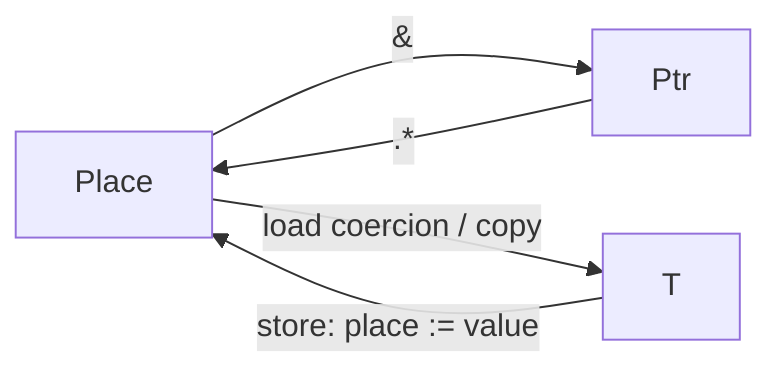

# Lifetimes, places, and shared ownership

A place denotes addressable storage inside the compiler. The source type
[`Ref<T>`](references.md) exposes a fixed, nonowning reference to that storage. Reading a place for a value consumer performs a compiler-generated copy;
assignment stores a value in a place, and address formation preserves its location.


Variables, pointer dereferences, and fields projected from places follow this
model. Array and span indexing returns `Ref<T>`, so user-defined indexing wrappers
can expose the same interface. `items.at(i)` is the element's place. The `.at()`
index parameter is `ulong`; other integer values require an explicit conversion.
Shared ownership builds on these rules by retaining on copy and releasing on drop.

Resin keeps ownership explicit in its types. `struct` declares an ordinary value;
`ArcPtr<T>` owns a shared heap allocation containing a `T`, while `ArcSpan<T>` owns
a fixed-length sequence of initialized elements. `WeakPtr<T>` and `WeakSpan<T>`
observe those allocations without keeping their payloads alive. All values support compiler-defined
copying. There is no `object`, `class`, `new`, ownership annotation, static move
checking, borrow checker, user-defined `Copy`/`Clone` trait, or move callback.

| Access or ownership | One value | Sequence |
| --- | --- | --- |
| Nonowning | `Ptr<T>` | `Span<T>` |
| Shared host ownership | `ArcPtr<T>` | `ArcSpan<T>` |
| Weak host ownership | `WeakPtr<T>` | `WeakSpan<T>` |
| GPU ownership | `GpuPtr<T>` | `GpuSpan<T>` |

`Ptr<T>` is a compiler primitive; the other families are ordinary generic library
structs. Import `$/span.resin`, `$/shared.resin`, or `$/gpu.resin` to use them.
Every type in this table is a value type, including `Span<T>`, whose
value is an address and element count. `ArcPtr<Span<T>>` shares a stored span
descriptor; `ArcSpan<T>` shares the elements themselves. These are distinct types
with distinct destruction responsibilities. Resin has no unsized payload types.

## Reads copy; expression composition transfers

Using a variable, field, or pointee as a value copies its contents. Address formation
and assignment destinations preserve the place instead. Indexing an array preserves
its storage address; it does not copy the array. Indexing returns
`Ref<T>`, so `items.at(i)` requests an element value and `items.at(i) = x` addresses
the element for assignment.

`Place<T>` is compiler terminology, not a source-level type. Variables denote places;
`p.*` produces the place addressed by `Ptr<T>`. Field projection from a place preserves
its address through nested access, including implicit dereferencing in `p.field`.
A value consumer requests a compiler-generated copy, while `&` yields the place's
pointer. User-defined wrappers return references with the same interface:

```resin
def at(items: Span<int>, index: ulong) -> Ref<int> = { items.at(index) };
// Inside a function:
at(items, 0_ul) := 42;
var copied = at(items, 0_ul);
var address = &at(items, 0_ul);
```

A function or type application consumes the resulting argument value. Infix operators are builtin function
applications and follow the same rule. Tuple, record, and array constructors consume
their initializers directly into their fields or elements. A fresh result can be
bound to a local, returned, or passed onward without an additional copy and drop.
Compiler-generated temporaries do not change these semantics.

```resin
var y = x;                  // Copy x, then transfer that result into y.
f(make_t());                // Transfer the fresh result into f's parameter.
f(x);                       // Copy x, then transfer the copy into f's parameter.
a + b                       // Copy a and b; the operator consumes its operands.
Pair { a = make_t(), b = x } // Transfer make_t()'s result; copy x into b.
ArcPtr<T>.alloc(x)?         // Copy x into a new shared allocation.
```

Value parameters own their arguments and receive ordinary scope cleanup.
Reference parameters borrow their referents without retaining or destroying them.
Returning a fresh expression transfers its result to the caller. Returning a named
parameter or local reads and therefore copies that value; the original still receives
cleanup. Names remain usable after reads. Assignment expressions preserve their
assigned value, so the stored value and the expression result are separate copies;
reassignment destroys the previous initialized destination.

| Type | Copy behavior |
| --- | --- |
| Primitive, `Ptr<T>`, `Span<T>` | Copy the value, address, or pointer/length pair |
| `ArcPtr<T>`, `ArcSpan<T>` | Retain the same allocation's strong count; do not copy its payload |
| `WeakPtr<T>`, `WeakSpan<T>` | Retain weak ownership bookkeeping |
| Struct or tuple | Recursively copy its fields |
| Array | Recursively copy its elements |
| `Err`, union | Recursively copy the active payload |

`Ptr<ArcPtr<T>>` points to an ArcPtr handle; `Ptr<T>` points to a `T`. Neither `Ptr<T>`
nor `Span<T>` owns or destroys its pointee. Copying an ArcPtr never copies its pointee.
Reference-count operations mean generated copying is not necessarily bitwise copying.

## Owned host sequences

Import `$/shared.resin` to allocate initialized, fixed-length shared sequences:

```resin
var values = ArcSpan<uint>.alloc(128, 0_ui)?; // ArcSpan<uint>
var alias = values;                 // Retains the complete allocation.
var view = values.get();            // Borrows a Span<uint>.
view.at(0) := 42_ui;
var bytes = view.as_bytes();        // Span<ubyte>
```

`ArcSpan<T>.alloc(count, initial)` returns `(ArcSpan<T> | Err<OutOfMemory>)`. It checks
allocation arithmetic and ownership bookkeeping, copies `initial` into each
element, and returns only after all elements are initialized. Empty allocations
are valid, and a zero-sized element still contributes to the logical count.
Allocation failure leaves no partially initialized owner. The final strong release
destroys the elements in reverse order and then releases their allocation.


`get()` borrows the owning handle just as `ArcPtr.get()` does. The returned span
does not retain the owner: keep an owning handle alive while using it. Indexing
through `values.get().at(index)` returns a borrowed `Ref<T>`. An owned span always
owns its complete allocation; it has no owning interior views. Its element count
cannot change, and changing a borrowed descriptor cannot change the allocation's
destruction extent.

On the host, `view.slice(start, length)` creates another borrowed span of the selected elements.
It preserves aliasing, carries the requested element count, and traps if the range
exceeds the original view. An empty slice at the end is valid, including
`slice(0, 0)` on an empty null view.

The host-only `Span<T>.as_bytes()` borrows the exact element storage as `Span<ubyte>` for numeric
elements. It preserves the address and multiplies the element count by the numeric
width, trapping if the byte count overflows. This is an explicit representation
conversion; it does not serialize values or change their byte order. Managed values
and arbitrary records do not support it.

`values.downgrade()` returns `WeakSpan<T>`. `WeakSpan<T>.empty()` creates an empty weak
reference, and `weak.upgrade()` returns `ArcSpan<T> | None`, preserving the complete
sequence and its count while it remains alive. Weak references do not delay element
destruction. As with shared pointers, atomic ownership counts do not synchronize
access to the elements.

## Construction and methods

`ArcPtr<T>.alloc(initial)` returns `(ArcPtr<T> | Err<OutOfMemory>)`. It is an
ordinary generic source method and copies its initializer into shared storage.
Returning its named parameter still performs the language's ordinary copy.
It does not transfer exclusive ownership of a raw native handle.

Native wrappers should allocate an inert payload first and then initialize its
handle through `get()`. Their destructor must tolerate that inert state:

```resin
import { "$/shared.resin" };

struct Resource { handle: Ptr<ubyte>,
    def make() -> (ArcPtr<Resource> | Err<_>) = {
        var owner = ArcPtr<Resource>.alloc(Resource { handle = Ptr<ubyte>(0_ul) })?;
        owner.get().handle := acquire_native_handle();
        (owner)
    },
    def address(self: Ptr<Resource>) -> Ptr<ubyte> = { self.handle },
    def drop(self: Ptr<Resource>) = {
        if (ulong(self.handle) != 0_ul) { release_native_handle(self.handle); };
    },
};
```
The example assumes native acquire/release declarations. A production factory
also handles native acquisition failure before exposing the completed wrapper.
Allocation failure occurs before acquisition, so there is no live handle to leak.

Method syntax supplies the first argument, whose name is ordinary. Pointer
receivers use the receiver's address; value receivers copy its value. Associated
functions supply all arguments explicitly. Signatures require explicit parameter
types; omitted results mean unit. There are no traits, interfaces, inheritance,
or dynamically dispatched methods.

`Span.at`, `ArcPtr.get`, `ArcPtr.downgrade`, and `WeakPtr.upgrade` are source
methods over checked compiler primitives. Array `at` and `Ptr.replace` retain
compiler-provided method signatures. `get` and `downgrade` borrow their owner
through a pointer receiver; `upgrade` borrows the weak handle in the same way.
Associated syntax can supply the receiver explicitly, as in
`ArcPtr<T>.get(&owner)`. A fresh value borrowed by a pointer receiver is saved
in the caller's scope, including for user-defined methods. The returned pointer
does not retain a separate owner if the original handle is overwritten.

`drop(self: Ptr<T>) -> ()` is an ordinary method that IR generation also registers
as a destruction hook. Direct calls use normal method lookup and receiver conversion.
They do not mark the value destroyed or suppress automatic cleanup: a native wrapper
that releases a resource explicitly must disarm its stored handle to make later
destruction safe.
The hook runs before automatic destruction of fields in reverse declaration order.
It must handle fallible cleanup locally. A wrapper releases its native handle in the
hook and lets generated cleanup release its managed fields. Explicitly unwrapping a
value with a destructor into its raw record representation is rejected.

Every actual copied struct receives its own `drop()`. A destructor that frees a raw
handle can therefore be unsafe to copy. The language does not prove such wrappers
correct. Native-library authors should initialize native owners in shared storage and expose
shared handles to ordinary callers. Passing a live raw owner to
`ArcPtr<Resource>.alloc(named_resource)` copies that resource value; the named
original still receives destruction. Copying an `ArcPtr<Resource>` handle instead
retains the same payload without copying it.

`pointer.replace(replacement)` supports deliberate native ownership transfer: it
returns the old pointee and installs the replacement without destroying the old
pointee. Its pointer must address initialized writable storage. For example, a
wrapper whose destructor tolerates a null handle can define an ordinary function:

```resin
def move(source: Ptr<Resource>) -> Resource = {
    Resource { handle = (&source.handle).replace(Ptr<ubyte>(0_ul)) }
};
```

The returned fresh Resource is transferred to its caller, and the source is left
disarmed. This is a wrapper-specific function, not a generic language move operation.
Simply returning a copy of `source.*` would leave the original destructor armed.

## Lifetimes and weak references

Initialized locals are destroyed in reverse scope order, including loop iterations
and early returns through `?`. Return values are preserved before cleanup. Discarded
owned expression results are destroyed. When `?` interrupts an expression, cleanup
interleaves its pending values with local owners in their relative lifetime order.
This applies equally to arguments, array elements, and other operands.
Compiler temporaries that hold an ArcPtr receiver's address retain its owner until the
end of the containing scope. A raw
address returned beyond that scope carries no ownership.

`arc.get()` returns `Ptr<T>`. Use `arc.get().field` or `arc.get().method()`
to access the payload; the wrapper has its own ordinary namespace. `arc.downgrade()` returns `WeakPtr<T>`. `WeakPtr<T>.empty()` is an empty weak
reference. `weak.upgrade()` returns `ArcPtr<T> | None`:

```resin
var weak = shared.downgrade();
match (weak.upgrade()) {
    ArcPtr<T>(owner) => { use_resource(owner); },
    None => { print(fmt("resource expired\n", ())); },
};
```

Values widen into optional unions directly, and `None` represents absence. Matching
is exhaustive. Postfix `optional!` removes `None` or traps; it transfers a fresh
payload and copies one read from a named value. See [optional values](options.md). The final
strong reference destroys and deallocates the payload. Weak references keep only
the control block alive. Upgrade is atomic with respect to the final strong release.
Strong cycles are not collected: use weak links to break ownership cycles. Atomic
reference counting does not synchronize access to the payload.

There is no lifetime tracking or use-after-free allocation registry. Raw pointers
and spans do not keep storage stable or alive, including when a container reallocates.
Native-library authors and users of raw addresses maintain those contracts.
Traps, aborts, and process termination do not unwind destructors.

## Host and GPU boundary

Reference counts and destructors run on the host. GPU code can address records
containing opaque `StrongOwner`/`WeakOwner` slots, including ordinary neighboring fields. Loading,
storing, copying, upgrading, or otherwise consuming a managed value is rejected
during concrete shader checking with a source-located diagnostic. This includes whole
aggregates containing managed values. Custom destruction is also host-only in this
implementation. `T | None` is available in shader-local values when `T` is compatible.

Managed handles use an opaque 64-bit slot in shared layouts. Their pointee layouts
need not be GPU-compatible. No pointer graph is translated or mirrored across the
host/device boundary. Compiler projection translates owning GPU views in a host launch record into the
shader's raw pointer/span representation, retaining all referenced allocations.

## Standard library

`Gpu`, `GpuPtr<T>`, `GpuSpan<T>`, `GpuImage`, `GpuComputePipeline<Root, Owner>`,
`GpuGraphicsPipeline<Root, Owner>`, `GpuCommands`, `Window`, `InputLine`,
and `ImageData` use shared owners. Copying them retains ownership. GPU resources
retain their device; a presentation device retains its window. Recorded pipelines,
images, copy buffers, and shader root buffers remain owned until synchronous
submission, cancellation, or destruction of the unfinished recording. Submit/cancel
clear the shared native command handle, so aliases see the same consumed state.
Submission errors return normally when device completion can be confirmed. If both
submission waiting and the fallback device-idle wait fail, the runtime terminates
before releasing resources that may still be in use.

`commands.dispatch(pipeline, arguments, x, y, z)` and
`commands.draw(pipeline, arguments, count)` check host arguments against the typed
pipeline, project them internally, and retain the root and its referenced
allocations after successful recording. `commands.draw(pipeline, None, count)`
supplies no root for a rootless graphics pipeline. Shader entry
parameters remain raw `Ptr<T>` values. Host `GpuPtr` and `GpuSpan` values are owning
GPU views. Indexing, slicing, and copying preserve their owner. Host access
uses checked `load`, `store`, and `replace` methods; it cannot obtain a raw host pointer. Allocation-wide recording state rejects CPU access until work completes or
is canceled; per-view permissions additionally control host reads and writes.
See [GPU buffers](gpu-buffers.md) for projection and layout requirements.

The standard library and its examples no longer require `gpu_destroy`, `gpu_free`,
`gpu_free_pipeline`, `gpu_free_image`, `window_destroy`, `free_input`, or `image_free`.
Those language-facing release functions have been removed. The native C ABI remains
explicit and unsafe. Native-handle fields remain an interoperability escape hatch;
fabricating or mutating them can violate the wrapper's lifecycle invariants.

Use struct destruction hooks for native resource cleanup, as shown in the
[ownership example](../examples/ownership.resin). Do not combine explicit native
destruction with automatic ownership of the same resource.
