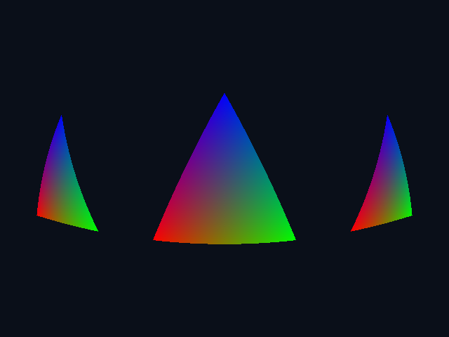

# Ray tracing with a fisheye camera

Import `$/gpu.resin` to build triangle scenes and trace them with Vulkan ray
tracing pipelines. See the complete
[fisheye example](../examples/eg013_ray_tracing.resin). It renders three colored
triangles to a PNG using one primary ray per pixel.

Ray tracing is an optional device capability. Check
`gpu:supports_ray_tracing()` after creating a GPU. Unsupported devices still
support their ordinary compute and graphics operations; scene creation returns
`Err<Unsupported>` when ray tracing is unavailable. This implementation requires
`VK_KHR_acceleration_structure`, `VK_KHR_ray_tracing_pipeline`, and
`VK_KHR_deferred_host_operations`, in addition to Resin's existing GPU requirements.
There is no ray query API or software fallback.

## Render primary rays through a fisheye camera

A primary ray starts at the camera and finds the first visible surface. This
example uses three instances of one triangle, a dark background, and vertex
colors interpolated at the hit. It has one sample per pixel, no lights, and no
secondary rays. A Kannala–Brandt camera makes the straight triangle edges appear
curved, while the scene and hit shader stay small.



*Rendered by `examples/eg013_ray_tracing.resin` at 640 × 480 on a GPU with Vulkan
ray tracing support. The image is checked in; building the book needs no ray
tracing hardware.*

### Run it

Follow [Getting started](getting-started.md) to build the runtime and start the
compiler service. With `RESIN_SERVER` set in your client terminal, run:

```sh
cargo run -- examples/eg013_ray_tracing.resin
```

The program prints `wrote ray-tracing.png` and saves the image in your current
working directory. No window or display server is needed. On a compatible Vulkan
GPU without ray tracing support, it prints a capability message and exits without
writing an image. Creating the GPU can still fail if Resin's baseline Vulkan
requirements are unavailable.

### Turn a pixel into a ray

The camera sits at the origin and looks along positive Z. Pixel centers are
`(column + 0.5, row + 0.5)`. Subtract the image center, flip Y so it points upward,
and divide both coordinates by the focal length in pixels. This gives `(px, py)`
and the image radius `r = sqrt(px*px + py*py)`.

We use the radially symmetric, four-coefficient Kannala–Brandt form, with equal
focal lengths and zero skew. The forward model maps incident angle θ to radius:

\\[
D(\theta) = \theta(1 + k_1\theta^2 + k_2\theta^4 + k_3\theta^6 + k_4\theta^8).
\\]

This convention is also used in [OpenCV's fisheye model](https://docs.opencv.org/4.13.0/db/d58/group__calib3d__fisheye.html);
see [Kannala and Brandt's original paper](https://users.aalto.fi/~kannalj1/calibration/Kannala_Brandt_calibration.pdf)
for the broader camera model. No OpenCV dependency is needed here.

Rendering runs this relation backward: the pixel supplies `r`, so solve
`D(theta) = r`. Newton's method repeatedly subtracts
`(D(theta) - r) / D'(theta)`. Its derivative has coefficients 3, 5, 7, and 9.
Once θ is known, the ray direction is
`(px * sin(theta)/r, py * sin(theta)/r, cos(theta))`.
At the image center the direction is exactly `(0, 0, 1)`, avoiding division by zero.

```resin
{{#include ../examples/eg013_ray_tracing.resin:camera}}
```

These illustrative coefficients are positive, so the radius function is strictly
increasing for nonnegative θ. Five Newton steps converge over this example's
640 × 480 image with a focal length of 230 pixels; even the corners remain in the
forward hemisphere. This is a small example camera, not a calibration solver for
arbitrary coefficients. Changing the lens or image extent requires checking the
inverse's convergence and angular domain.

Setting all four coefficients to zero gives the equidistant fisheye relation
`r = theta`; it does **not** turn the camera into a pinhole camera. A pinhole
comparison would use the normalized direction `(px, py, 1)` instead. Reducing
focal length widens the view, subject to the inverse's valid domain. The rays are
traced through the scene with these directions directly; there is no image warp
or additional rendering pass.

### Pass parameters and return a color

The host and shaders share one parameter shape:

```resin
{{#include ../examples/eg013_ray_tracing.resin:parameters}}
```

On the host, `Parameters<GpuSpan<u8>>` retains the output allocation. The pipeline
projects it to `Parameters<Span<u8>>` for all three shader stages. `Color` is the
ray payload: three `f32` values carried into and back out of traversal.

```resin
{{#include ../examples/eg013_ray_tracing.resin:shaders}}
```

Ray generation recovers column and row from the flattened index, computes a
camera ray, calls `trace_ray`, and writes four RGBA bytes. Each invocation owns
one pixel. The launch is exactly `width × height × 1`, so no workgroup rounding or
extra-invocation guard is needed.

Vulkan calls `miss` when no triangle intersects the ray interval, or `closest`
for the nearest hit. The returned payload resumes the ray-generation shader.
`ray_hit_info().3` and `.4` are the second and third barycentric weights; the
first is `1 - U - V`. Assigning these weights to red, green, and blue gives a
smooth triangle gradient without normals, textures, or a lighting model.
`write_pixel` clamps these display colors to `[0, 1]`, scales them to bytes, and
writes an opaque alpha channel. There is no tone mapping or color-space conversion.

### Build the scene and save the result

The mesh has three XYZ vertices at Z = 0. Its three instance transforms translate
it to X = −3, 0, and 3, all at Z = 2. The side triangles make the fisheye distortion
more obvious. Scene creation copies the host arrays before their owners leave
`triangle_scene`.

```resin
{{#include ../examples/eg013_ray_tracing.resin:scene}}
```

Finally, create the pipeline from the three decorated declarations, record the
ray launch, wait for submission, and copy the output to host memory for PNG I/O:

```resin
{{#include ../examples/eg013_ray_tracing.resin:render}}
```

The pipeline retains the scene, and recording retains the projected output.
The cloned pixel handle lets the host read the same allocation after submission.
`submit()` waits before `copy_to`; there is no asynchronous readback to coordinate
in this example. The scene, camera math, shaders, and image output are all in the
[complete source](../examples/eg013_ray_tracing.resin).

## Scene ownership

`gpu:create_ray_scene(vertices, transforms)` accepts two `Span<f32>` values:

- Vertices contain tightly packed XYZ triples. Each consecutive three vertices
  form one opaque triangle. The vertex span must be nonempty and its length a
  multiple of nine floats.
- Transforms contain row-major affine 3×4 matrices, twelve floats per instance.
  Supply at least one finite, invertible transform. Instance indices follow input
  order. An identity transform is `[1,0,0,0, 0,1,0,0, 0,0,1,0]`.

Creation copies the inputs, builds one bottom-level acceleration structure for
the mesh and one top-level structure for its instances, and waits for completion.
The input spans can then be released. Scenes are immutable; changing geometry or
transforms requires creating another scene. Build scratch storage is temporary.

`scene:create_ray_tracing_pipeline(generation, miss, closest)` takes direct
shader declarations and returns a `GpuRayTracingPipeline<Root, Owner>`. The pipeline
retains its scene and GPU; it remains valid after the original scene handle is
released. The runtime owns shader groups, the shader binding table, alignment,
and the fixed recursion-depth setting.

## Stage interfaces

All three shaders use the same `Ptr<Root>` second parameter:

| Decorator | Signature | Meaning |
| --- | --- | --- |
| `@ray_generation_shader` | `(u64, Ptr<Root>) -> ()` | Generate rays and write output. |
| `@miss_shader` | `(Payload, Ptr<Root>) -> Payload` | Return the payload for a miss. |
| `@closest_hit_shader` | `(Payload, Ptr<Root>) -> Payload` | Return the payload for the nearest triangle hit. |

Ray generation receives the flattened launch index `x + width * (y + height * z)`.
Dispatch dimensions count rays, not compute workgroups. Pass dimensions through
`Root` when the shader needs to recover coordinates.

A pipeline has one payload type. It must match the miss/closest-hit input and
result types and every reachable `trace_ray` call. Payloads contain `f32`, `i32`,
`u32`, or arrays/records composed of them. Pointers, managed values, unions, and
other scalar widths are not supported in payloads. The compiler gives payloads
their own shader interface; they are not ordinary device pointers.

```resin
let result = trace_ray(ox, oy, oz, dx, dy, dz, minimum, maximum, initial);
```

The first eight arguments are `f32`; `initial` determines the payload type.
The ray is `origin + t * direction`. Use finite inputs, a nonzero direction, and
`0 <= minimum <= maximum`. Direction need not be normalized; hit distance is the
parameter `t`. Every instance is visible to every ray in this initial API.

`trace_ray` is available only from ray generation and its helpers. Sequential
traces in a loop are supported; tracing from miss or closest-hit is rejected.
This keeps Vulkan's maximum pipeline ray recursion depth at one.
Checked failures, such as a failed assertion in a hit or miss shader, propagate
through `trace_ray` and stop its calling ray-generation invocation. Earlier writes
remain visible; other launch invocations continue independently.

`ray_hit_info()` is available only from closest-hit and its helpers. It returns
`(f32, u32, u32, f32, f32)`: hit distance, primitive index, instance index, and
triangle barycentric coordinates U/V. The remaining barycentric weight is
`1 - U - V`.

## Recording and limits

`commands:trace_rays(pipeline, arguments, width, height, depth)` projects host
arguments to the pipeline's `Root`, just like compute dispatch. Width, height,
and depth are `u32`. Recording checks the device's dispatch limits and retains
the pipeline and projected allocations until submission or cancellation.
`commands:submit()` waits for completion before host readback.

The initial implementation supports one mesh with multiple instances, one miss
shader, one triangle hit group, and opaque triangles. It does not expose any-hit,
procedural intersections, callable shaders, nested tracing, per-material shader
binding records, acceleration-structure updates, or compaction.

Compiler and SPIR-V validation tests run without ray tracing hardware. To require
hardware execution instead of permitting capability skips:

```sh
nix-shell --run 'RESIN_REQUIRE_SPIRV_TOOLS=1 RESIN_REQUIRE_RAY_TRACING=1 VK_INSTANCE_LAYERS=VK_LAYER_KHRONOS_validation cargo test --features gpu --test ray_tracing'
```
