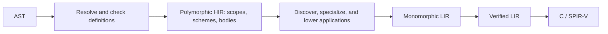

# Template implementation architecture

Status: proposed implementation of the [template language design](templates.md).
This changes the HIR contract and HIR-to-LIR lowering; it does not describe the
current compiler. Templates, contextual deduction, and editor analysis use the
same architecture as ordinary functions from the beginning.

## The retained program is polymorphic HIR

HIR stores definitions, their type schemes, and one typed body per definition.
Checking a use instantiates its scheme as needed to determine types and validate
requirements. It does not append a concrete function body to HIR. HIR-to-LIR
lowering discovers the required monomorphs and emits concrete LIR.



There are no additional public passes for a resolved program or checked instance
program. Name resolution and inference are private work inside HIR construction;
enumerating monomorphs is private work inside LIR lowering. The driver continues
to sequence the existing language boundaries.

The HIR guarantee becomes: names are bound, definitions have completed schemes,
and bodies are typed subject to explicit requirements on their parameters.
There are no live inference variables, unresolved ordinary names, or callbacks
into construction state. Dependent operations are part of HIR's language, with
defined substitution and checking rules. LIR's guarantee remains fully concrete.

This is a substantial redesign of [HIR](../crates/resin-hir/src/lib.rs), not an
extra template path attached to the existing concrete checker:

| Current arrangement | Proposed arrangement |
| --- | --- |
| A HIR function identifies one concrete signature and body | A definition identifies a scheme and one polymorphic body. |
| HIR owns the final concrete type and function tables | HIR owns source type families; LIR construction owns concrete output identities. |
| [Checked terms retain lexical cursors and names](../crates/resin-hir/src/lower/typed.rs) | Terms reference definitions and bindings directly. |
| [Elaboration repeats lexical lookup](../crates/resin-hir/src/lower/elaborate.rs) | Binding is completed during HIR construction; dependent lookup is an explicit typed operation. |
| [LIR copies HIR's tables and lowers functions one for one](../crates/resin-lir/src/lower/mod.rs) | LIR owns an application worklist, concrete type construction, and function emission. |
| Editor analysis retains construction contexts | Queries read immutable HIR scopes, schemes, and recorded use-site facts. |

## Scopes, definitions, and types

Give HIR its own definition, binding, scope, and source-node identities. A source
span is a diagnostic location, not a unique expression identity. Identities are
stable within an immutable program version; cross-edit identity is not required.
Retain the defining module and nominal namespace as explicit references.

An immutable scope records its parent, declarations, and their visibility order;
each definition carries its completed scheme. Retain the parent visibility point
where needed so editor queries do not expose later local bindings earlier in the
source. These are retained language data, useful for imports and editor queries.
Mutable scope builders, lookup cursors, recovery state, and solver
arenas remain private to construction. A body references a resolved definition
directly rather than asking a scope to reinterpret an identifier during lowering.
Dependent member lookup uses the eventual receiver's defining namespace, never
the caller's lexical scope.

HIR needs a type vocabulary distinct from concrete `resin_types::Ty`:

| Representation | Meaning |
| --- | --- |
| HIR type | A primitive, bound parameter, structural constructor, nominal application, or explicitly derived dependent type. |
| HIR scheme | Named quantified parameters, a signature, and the requirements that make its body valid. |
| Private inference type | An unfinished equation term with variables owned by a definition-checking group or call deduction. |
| `resin_types::Ty` | A concrete type used for layout, representation, LIR, and backend operations. |

For example, a scheme for `identity` is `forall T. (T) -> T`, with no additional
requirements. A scheme for `add` has the same parameter repeated twice and a
requirement that Resin's addition operation is valid for it. Ordinary functions
have schemes with no quantified parameters and use the same checker.

Only declared type parameters are quantified. A local `var` still has one type
within its enclosing application. An inferred `_` must resolve to a concrete or
symbolic HIR type; it never silently becomes another universally quantified
parameter. Bound parameters are rigid while checking their definition. Applying
a callee scheme introduces fresh deduction variables in the caller's session;
those variables may resolve to types containing the caller's bound parameters.

```resin
def add<T>(left: T, right: T) -> T = { left + right };
def twice<U>(value: U) -> U = { add(value, value) };
```

The call in `twice` records `add<U>`. HIR contains one definition of each function,
regardless of how many concrete applications the eventual program needs.

## Dependent operations are typed data

Template behavior does not require proving that a body works for every possible
type. Check what is known and retain the exact requirements that depend on bound
parameters. Invalid independent operations, unbound names, and duplicate
parameters are errors even in unused templates. An unused `add<T>` may retain an
addition requirement; `add<bool>` must fail when that requirement is checked.

Use explicit operations and derived types for the dependent cases. Illustratively:

| Expression or operation | Information retained in HIR |
| --- | --- |
| `left + right` of the same parameter type `T` | Operand/result type `T` and the requirement that builtin addition accepts `T`. |
| `value.member` for unknown `T` | A member projection, its derived type, and requirements on field selection, addressability, and permitted access. |
| `value.method(args)` for unknown `T` | A dependent method application with receiver, argument terms, lookup policy, derived parameter/result types, and adaptation requirements. |
| A literal whose type is `T` | Its exact magnitude/sign, numeric kind, and range requirement for `T`. |
| A layout query involving `T` | A typed compile-time layout operation, to evaluate after substitution. |
| A conversion or branch join involving `T` | The appropriate conversion or join relation, with its dependent result if needed. |

These requirements are compiler language data, not user-written traits or a new
operator-overloading mechanism. Operations on known nominal families can often
resolve immediately: accessing `Pair<T>.left` already has type `T` and a known
field identity. Fully dependent operations retain only the selection they can
justify; specialization completes it using the same language rules.

Dependent access must retain enough information for assignment and taking an
address, as well as reading a value. Field selection, receiver dereferencing,
place category, and required read/write access belong to the operation's contract.
Specialization resolves those facts or diagnoses the use; it also preserves
required runtime access checks for GPU-backed pointers and spans. A member name
plus a result type alone is not a complete field-access operation.

In particular, consider:

```resin
def field<T>(value: T) -> _ = { value.member };
```

Its result is the type of `T.member`, with a requirement that the member exist.
It is not a fresh caller-selectable `R` in `forall T, R. T -> R`. Every derived
type identifies the operation that determines it. Substitution normalizes that
operation once its inputs are known. An unresolved private inference variable
without such a producer is an error, not a dependent HIR type.

Call requirements compose: applying `twice<U>` brings the requirements of
`add<U>` into checking. Keep references to requirement sets and application
arguments where expanding them would duplicate recursive bodies. Concrete uses
can evaluate these semantic dependencies ad hoc during HIR construction; symbolic
uses retain them. Bounded request state prevents infinitely expanding dependent
type computations from overflowing the compiler stack.

Method parameter types are producers too:

```resin
def call<T>(value: T) -> _ = { value.take(1) };
```

Until `T` selects `take`, the literal depends on that method's parameter type.
Retain this dependency and its argument/receiver adaptation requirements; do not
default `1` to `long` during definition checking. A specialization whose method
takes `int` selects an `int` literal, while one taking `ulong` selects `ulong`.
The literal's type is derived from the method parameter, not a free variable
stored in HIR. The same rule covers fields and other dependent expected types.

## Scheme inference and contextual literals

Check definition dependency groups and complete their schemes before publishing
them to unrelated callers. A call instantiates a completed scheme; it cannot
mutate the definition's inference session. Within a recursive group, solve the
group's result equations together, with its bound parameters kept distinct.
Incoming caller constraints do not choose its inferred signatures. Recursive
signature applications are explicit dependencies; reject a cycle that has no
determinate result rather than retaining an arbitrary result variable.

Each recursive reference carries its type-argument substitution. Being in one
dependency group does not equate distinct binders or make `f<T>` and `f<Ptr<T>>`
share one instantiated result variable. Solve equations over the definitions'
symbolic signatures and their applications. Retain recursive applications with
determinate signatures; diagnose unanchored result derivations. Bound expanding
applications when evaluating dependent requirements and when enumerating LIR.

An inferred result can normalize to a useful pattern:

```resin
def identity<T>(value: T) -> _ = { value }; // completed result is T
def plain() -> _ = { 1 };                 // completed result is long
def total() -> int = { identity(42) };     // identity<int>
```

Deduction uses the completed result shape, whether declared or inferred once.
`plain` remains `() -> long`; its callers cannot specialize its unsuffixed `1`.
Opaque member-result or other non-invertible type computations cannot be used
backwards to guess a missing type argument. The checker never searches for a
type whose instantiated body or requirements happen to succeed.

One call-checking path handles ordinary functions, templates, methods, and
compiler-provided operations:

1. Apply explicit type arguments and match already determined argument types
   against parameter patterns. Leave unsuffixed literal constraints flexible.
2. Use an available expected result to fill remaining parameters through the
   completed result pattern. Preserve equality, deduction, and conversion as
   distinct relations; expected context must not overwrite fixed arguments.
3. Propagate constraints through nested calls, aggregates, and later uses of
   local bindings. Normalize derived results whose inputs are known. Check
   decidable requirements; retain parameter-dependent ones in the enclosing HIR.
4. After productive dependencies settle, default unconstrained numeric components
   to `long` or `float64`. Check selected literal ranges and diagnose remaining
   ambiguous nonnumeric arguments. Never retry a wider type after range failure.

Keep literal payloads exact until their type is known. A literal connected to a
bound parameter retains a numeric/range requirement; it is not an unconstrained
number eligible for defaulting. A literal independent of parameters defaults
while completing the definition's scheme. This distinction prevents an arbitrary
first caller from choosing the meaning of a template body.

Completed schemes remove many apparent instance-scheduling dependencies:

```resin
def value<T>(unused: T) -> _ = { int(3) };

def example() -> _ = {
    var n = 1;
    var x = value(2);
    n := x;
    n
};
```

`value` already has result `int` in its scheme. The assignment selects `int` for
`n` and the enclosing result; the independent argument `2` defaults to `long`.
There is no need to build `value<long>` before learning its return type. Likewise,
`var n = identity(1); n := value(2);` selects `identity<int>`.

Some derived results genuinely need their inputs first. Represent these as
pending semantic requirements with explicit producer dependencies. At a fixed
point, default only numeric components whose possible producers have completed
or lie within the same blocked dependency component, then resume normalization.
An unfinished external producer requires waiting. Unrelated literals must not
default merely because one dependent request needs a type. An unresolved cycle
without a numeric fallback is a deduction error. This is local type inference
over schemes and requirements, not a queue of emitted function instances.

Named error parameters obey Result's error-kind requirements. Inferred error
holes collect a symbolic least union of propagated errors, which substitution
normalizes to a concrete union. Recursive groups close their inclusion equations
together; `Never` is correct only when all contributors are known to be empty.
Do not treat a pending error producer as empty or generalize its accumulator.

## Specialization belongs to HIR-to-LIR lowering

[LIR lowering](../crates/resin-lir/src/lower/mod.rs) owns a worklist keyed by HIR
definition and closed type arguments. Associated methods include their owner
application; definitions nested in a generic context include its type arguments.
Keys use normalized closed HIR types before final concrete `TypeId`s need to
exist. Normalize aliases and derived argument types before comparing keys, so
an inferred member type that resolves to `int` reuses an explicit `int`
application. Preserve nominal origins and arguments without recursively expanding
their fields to compare identities. Closed argument types contain no bound
parameters or undecided projections; dependent operations in the body resolve
when specializing that application.

The worklist does the following:

1. Seed concrete entries and required declarations. Initially include every
   ordinary function with zero type parameters to preserve existing unused-function
   diagnostics, including initialization errors diagnosed by LIR lowering.
2. Reserve a LIR `FunctionId` when a new application is requested. Recursive
   references reuse that identity; they do not recursively lower another body.
3. Substitute its arguments and discharge the HIR requirements. Obtain a
   temporary specialized view or body with resolved operations and closed types.
4. Materialize concrete types, then lower local storage, evaluation, copies,
   cleanup, and structured control flow. Callee applications request worklist
   entries and become concrete LIR function references.
5. Discard the temporary body. Finish every requested function and type before
   returning a LIR module; report specialization or storage errors otherwise.

Calls are not the only references. Function values, shader artifacts, pipeline
bridges, compiler operations, and implicit drop hooks also request functions.
Preserve source evaluation order and evaluate runtime arguments exactly once.
No worklist operation executes Resin initializers at compile time. Use stable
request order, deduplicate complete application keys, and bound unbounded growth
with a diagnostic showing the application chain.

Substitution and requirement checking remain HIR semantic operations, used both
by ad hoc frontend checking and LIR specialization. For example, the public HIR
API may provide the following completed-result operation:

```rust
pub fn specialize_function(
    module: &Module,
    application: &FunctionApplication,
) -> Result<SpecializedFunction, SpecializationError>;
```

This illustrative operation specializes one body. Its callee references remain
HIR definitions with closed applications; it assigns no LIR IDs and enumerates
no emitted bodies. It may resolve dependent signature requirements using bounded
temporary state. It never reparses source, repeats lexical name resolution, or
runs a second set of type rules. Its result is consumed and discarded by lowering,
not retained as another whole-program representation or a monomorph list in HIR.

The existing `resin-lir` dependency on `resin-hir` supports this API without a
reverse dependency. Publish the symbolic language and its small semantic API in
HIR's `lib.rs`; keep substantial substitution/checking algorithms private.
LIR's public API continues to accept HIR and return concrete LIR or diagnostics.
LIR verification and code generation never see schemes or dependent operations.

## Concrete types, methods, and lifecycle

HIR retains nominal declarations, field types, method namespaces, and drop
declarations. A nominal application is identified by its definition and arguments,
including enclosing generic arguments for any local nominal declaration. Thus
the local type of `f<int>` is distinct from the corresponding type of `f<float32>`.
Transparent aliases normalize to their targets without changing nominal origins.
Deduction uses those origins, never names or equivalent record layouts.

LIR construction owns the canonical mapping from closed nominal applications to
the final `TypeId`s. Reserve identities for recursive types, resolve fields and
hook signatures, reject infinite inline layouts and alias cycles, and publish
complete concrete definitions. A method can inspect completed owner fields
without waiting for every method body to finish.

Lifecycle classification must know both fields and drop declarations. Reserve
the real LIR function identity for a required drop application before installing
its concrete hook metadata. A pending hook body does not make its owner unmanaged.
Copy/drop and GPU-admissibility queries must not observe placeholder hook IDs or
a temporary `drop = None` used to break a construction cycle.

`resin-types` remains independent of HIR and owns concrete layout and conversion
rules. HIR semantic checking can use private concrete checking tables when these
rules are needed early. Temporary table IDs must never escape through retained
HIR or a specialized result. This applies to every type-bearing payload, including
conversion plans, field selections, type values, and aggregate constants. Translate
concrete checking results back to HIR types and nominal applications before
returning them; LIR materializes those in its final table. Nominal identity and
symbolic substitution remain HIR concepts. This avoids either making `Ty` partly
unresolved or teaching the concrete types crate about source declarations and
schemes.

Source functions, foreign declarations, and compiler-provided methods share
scheme application and argument checking. Their implementations remain explicit
alternatives: source body, foreign declaration, or compiler operation. Builtin
registration stays in [HIR context construction](../crates/resin-hir/src/lower/context.rs).
Operations requiring decorated shader identity retain that domain fact; this
does not introduce general value parameters. Intrinsics that must execute at
the call site remain inline operations during specialization and LIR lowering.
GPU allocation and pipeline projection use these same checked signatures.

## Diagnostics, imports, and immutable analysis

Source exports identify definitions, including template families. Executable
entries and decorated shader entries select concrete signatures initially.
Imported definitions retain access to resolved private helpers in their defining
module. The same application requested through different importers has one LIR
identity. Templates must not be flattened into arbitrary concrete exports.

Report independent definition errors during HIR construction, concrete use errors
as soon as their requirements can be checked, and remaining specialization
errors while producing LIR. Each failure carries its source location and the
applications that required it. Error ownership follows the producing phase;
specialization failures remain HIR errors transported through LIR's result.

The [compiler's current error mapping](../crates/resin-compiler/src/lib.rs)
indexes HIR functions with a LIR function ID. Remove that assumption: one HIR
definition can now produce several LIR functions. Lowering diagnostics need
their source origin and specialization trace directly. `Compilation.hir()` can
retain the polymorphic program even if a required LIR specialization fails.

Editor queries read declaration schemes and completed use-site application facts.
A source expression in a template has a symbolic type; a concrete use may have
an instantiated signature. Keep use-site facts separate from definition facts,
keyed by source-node identity and application as appropriate. Never overwrite a
generic expression's type with the last specialization inspected. Completion for
an unconstrained parameter cannot invent members from an unrelated application.

Keep construction solvers and temporary semantic request tables out of retained
analysis. Recover failed constraints without publishing speculative deductions
into healthy facts. Freeze completed HIR and analysis together; hover, completion,
and navigation do not enumerate monomorphs or mutate old results. Preserve the
compiler's immutable source/compilation cache and reload the import graph before
reusing a result after edits.

## Implementation layout and migration

Keep the public languages and operations in each crate's `lib.rs`. HIR's private
`lower` modules own AST translation, binding, and scheme inference. Substantial
semantic substitution and requirement algorithms may live in a private HIR
module shared by construction and specialization. LIR's private `lower` modules
own the application worklist, concrete identity maps, and storage lowering. These
are cohesive responsibilities, not a mandate for many small forwarding modules.

1. **Introduce the HIR model for ordinary programs.** Store immutable scopes,
   resolved references, symbolic type constructors, and completed schemes with
   empty parameter lists. Move editor queries onto those facts. Remove lexical
   re-lookup during elaboration and keep private inference state out of HIR.
2. **Move concrete identity and emission into LIR lowering.** Replace one-for-one
   function traversal and table copying with the application worklist. Give
   diagnostics direct origins. Establish HIR's semantic specialization operation
   on ordinary definitions, using the same checking rules as construction.
3. **Enable function templates and contextual deduction.** Add syntax, bound
   parameters, derived dependent types, and requirement inference. Check bodies
   polymorphically and instantiate schemes at uses. Ship imports, inferred-result
   patterns, suffix-free literals, and editor analysis together.
4. **Enable nominal and method templates.** Add family applications, aliases,
   owner substitution, and specialized destruction hooks. Reuse the same scheme
   application rules for source methods and compiler-provided operations.

Each step leaves ordinary programs usable and replaces the relevant old path.
Do not keep a separate ordinary-function checker as a compatibility architecture.
The implementation must update the HIR contract in the architecture guide and
repository instructions when the new boundary actually ships.

Boundary tests should establish that HIR retains one body per definition, contains
no live inference variables or emitted monomorph table, and can be lowered after
construction state is discarded. Verify symbolic member results cannot be chosen
by callers; inferred `T` results can guide deduction; independent results remain
fixed; numeric producer ordering, literal ranges, and union/Result widening work.
Exercise shadowing, distinct nodes with equal spans, recursive schemes and growing
applications, instance reuse across imports, and local nominal origins.

Check failure recovery and old editor results after edits. Verify monomorphic
LIR's complete function/type/drop mappings, including implicit references. Run
end-to-end C and direct shader-helper examples with ownership-sensitive arguments,
rejected managed GPU values, recursive shader rejection, argument evaluation
counts, and native ABI checks. Backends should need no template-specific rules.
