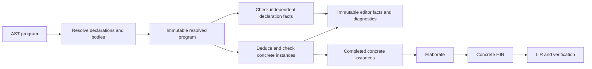

# Template implementation architecture

Status: proposed implementation of the [template language design](templates.md).
This document describes the intended replacement for HIR construction, not the
current implementation. Templates, contextual deduction, and editor analysis
should share that architecture from the beginning.

## The frontend's organizing model

Build one immutable resolved program, then check concrete instances of its
declarations. An ordinary function is a declaration with zero type arguments.
Function templates, nominal type instances, methods, and compiler operations use
the same declaration identities and call-checking vocabulary.



These are named private stages of `resin-hir` construction. Each has a completed
data result and an explicit owner for unfinished work. Keep the public HIR
contract concrete and keep the compiler driver responsible for pass sequencing.
A new public crate is unnecessary while these stages have one consumer: the
operation that constructs HIR and editor facts. Their internal contracts still
need to be independently readable and testable.

This replaces several current arrangements:

| Current arrangement | Replacement |
| --- | --- |
| [Each module is checked and elaborated immediately](../crates/resin-hir/src/lower/mod.rs) | Resolve the complete import-ordered program before scheduling bodies. |
| One declaration maps to one HIR function | A declaration identifies a family; each concrete instance has its own identity. |
| [Checked terms retain lexical cursors and identifier names](../crates/resin-hir/src/lower/typed.rs) | Terms retain resolved references and source-node identities. |
| [Elaboration performs lexical and method lookup](../crates/resin-hir/src/lower/elaborate.rs) | Completed terms already identify their callees, fields, conversions, and argument packing. |
| [Scope construction mutates retained editor analysis](../crates/resin-hir/src/lower/scope.rs) | Construction produces lexical facts and instance facts that are frozen for queries. |
| A file-level solver owns all inferred signatures | Instance-owned inference with explicit dependencies on callee results. |

Do the replacement for existing monomorphic programs first. Keeping an old
ordinary-function compiler beside a new template compiler would preserve the
wrong boundaries and give numeric inference two sets of rules.

## Resolved source data

Resolution consumes the AST program and produces declarations, resolved bodies,
exports, and a lexical visibility index. It allocates module and declaration
identities before resolving references, preserving forward declarations and
mutual recursion. Imports and exports identify declarations, including templates.
They do not require a concrete function ID.

Use distinct identities for declarations, local bindings, type parameters, and
source expression nodes. IDs are stable within one immutable program version;
their numeric values need not survive an edit. Source spans describe diagnostics,
not identity: separate expressions can have the same span in recovered or
constructed trees.

A resolved reference names a declaration or local binding directly. A type
parameter reference names its binder. Preserve field and method names when their
receiver types are dependent; choosing a member later is type-directed lookup,
not a second lookup in the caller's lexical scope. A failed lookup produces a
diagnostic and a recoverable error node so unrelated declarations remain usable.

Signatures retain bound type expressions: concrete primitive types, named
parameters, structural constructors, applications of named declarations, and
explicit inference holes. Represent application with a constructor identity and
an argument list rather than adding AST/HIR cases for every new user type name.
Builtin constructors retain explicit representation and arity rules. Array
lengths remain concrete values in their dedicated representation.

The lexical visibility index supports completion and navigation. Instance
checking and elaboration receive resolved bodies, and must have no capability
to perform lexical lookup through that index. Retaining an AST plus a scope cursor
would not establish this boundary.

## Three distinct kinds of type information

| Representation | Meaning and lifetime |
| --- | --- |
| Bound type expression | Immutable declaration syntax with named parameters and holes. It describes what may be instantiated. |
| Inference type | A constraint term containing variables owned by a checking session. It describes unfinished deduction or result inference. |
| `resin_types::Ty` | A concrete type, usable for identity, layout, conversions, and published HIR. |

A named template parameter is never a solver variable. A use of the declaration
allocates deduction variables for its parameters, and then fixes them to concrete
types before the body is checked. An explicit `_` inside that body allocates a
fresh variable in that instance's session. No solver variable is stored in a
template declaration or in `resin-types`.

Use one expression-constraint generator for declaration checks and instance
checks. Declaration checks treat bound parameters as dependent types and retain
only justified facts. An operation connected to dependent constraints waits for
an instance. In particular, do not default a literal during declaration checking
when a dependent use could later supply its type. Closed, non-dependent invalid
operations and unbound names still produce declaration diagnostics.

Checking an instance supplies concrete substitutions to the same resolved body
and checking rules. It does not consume a supposedly fully typed generic HIR and
then redo overload resolution behind that HIR's contract.

## One engine for concrete instances

The construction owner contains the immutable resolved program, concrete type
construction state, instance records, checking sessions, and explicit work queues.
Store those fields on that owner; avoid forwarding context wrappers and
callback-based query frameworks. Requests, pending constraints, and dependency
edges are ordinary inspectable data.

Conceptually, a function instance key contains:

```rust
struct FunctionInstanceKey {
    declaration: DeclarationId,
    owner: Option<TypeId>,
    arguments: Box<[Ty]>,
}
```

`owner` identifies a concrete nominal receiver for an associated method; ordinary
functions have none. Empty `arguments` are normal. Type instance keys also record
an enclosing function instance for a type declared locally inside a function.
This makes a local nominal type in `f<int>` distinct from the corresponding type
in `f<float32>`, even if their layouts happen to agree.

Maintain an explicit progression: reserved identity, collected constraints,
waiting on dependencies, completed instance, or failed instance. A reserved
function identity is sufficient for a recursive reference, but is not evidence
that its signature or body has passed checking. Record each requesting call site
separately from the deduplicated instance so diagnostics can explain every use.

Seed ordinary declarations with empty argument lists to preserve diagnostics in
unused ordinary functions. Validate every template declaration, and request its
concrete instances when calls, explicit references, or required methods need them.
Use deterministic source/declaration order for equally ready requests. Deduplicate
instances by their complete keys; apply explicit expansion limits to growing
type/instance requests with an explanatory request chain.

The checker returns a concrete checked body only after all of its obligations
are discharged. No pending instance, unknown field, receiver adaptation, or
inference hole crosses into elaboration.

## Deduction and result dependencies

A source call first creates a call request: its declaration, explicit arguments,
runtime argument terms, expected-result information, deduction variables, and
location. A request exists before its concrete instance key is known. This is
necessary to explain why deduction is blocked without choosing a speculative
instance.

An explicit function reference such as `function<int>` also requests a signature,
even if it is never called directly. Its inferred result dependencies participate
in the same scheduling and recursion rules as calls.

Match concrete arguments and explicit type arguments against the declaration's
parameter patterns. Keep literal constraints flexible. Expected-result matching
can fill remaining parameters through declared result patterns; once an argument
is fixed, preserve the ordinary result conversion relation, including union and
Result widening. The solver must distinguish equality, deduction, and conversion
obligations rather than represent all three as equality.

For example, an expected `int` can determine `T` through `identity<T>(x: T) -> T`.
It cannot determine `T` by examining the body of `f<T>() -> _`. A partially
declared result such as `Result<T, _>` can expose the `T` pattern while keeping
the error hole owned by the callee.

Result holes introduce a directional dependency. The caller owns a result-use
variable; the callee owns its inferred result variable. Until the callee's result
is completed, the call records that dependency instead of unifying the two across
sessions. On completion, copy the concrete result type into the caller's checks.
Thus `def plain() -> _ = { 1 };` still returns `long` even if a caller wants `int`.

Recursive instances form the exception to this publication boundary. Discover
signature dependencies from calls and selected function references, and check
each strongly connected component together: results can constrain bodies inside
the component, but incoming caller constraints cannot
choose its inferred signatures. If discovery adds an edge that changes a pending
component, recompute it before finalization. Completed external dependencies are
immutable inputs. Inside a recursive component, error-inclusion equations reach
their least fixed point; close its accumulators together once every external
contributor is complete. Do not turn a pending external error result into `Never`
or require mutually dependent accumulators to finish one at a time.

Inference variables remain instance-qualified even while solving a recursive
component. Retain each instance's equations as data over identities such as
`VariableId { instance, local }`. Construct a solver for the eligible component
from those equations and completed external signatures, admitting recursive
result links explicitly. Rebuild and replay when the component grows or recovery
removes a failed producer. Record chosen numeric defaults as explicit request
facts. This avoids merging live solver arenas or publishing a solver handle as
an inferred signature.

## Scheduling and numeric defaulting

The scheduler alternates explicit operations until it can publish complete
instances. It does not recursively invoke the compiler from inside unification.

1. Collect constraints for reserved instances and resolve currently decidable
   equations, conversions, member operations, and call requests. Check literal
   ranges as soon as their types are fixed, before requesting bodies that depend
   on those arguments.
2. Request instances whose arguments have become concrete. Make their known
   declared signature parts available, and record dependencies for inferred parts.
3. Check ready producers and propagate their completed results. Update recursive
   components when new instance edges are discovered.
4. When deduction is blocked only by unconstrained numeric arguments, default
   the numeric components necessary to determine a request's key. First wait for
   pending result producers that could still constrain those components.
5. At a closed component with no remaining productive external dependencies,
   apply remaining numeric defaults, finish error sets, and check literal ranges.
   Complete the checked bodies or report a concrete unresolved/cyclic obligation.

Track dependencies for call requests as well as known instances. If one request's
numeric key depends on another request's result, schedule that producer first.
An edge from request A to request B means an unpublished inferred result of B can
still constrain A's key. At quiescence, process sink components of this wait graph:
fallback is permitted only when every unfinished key producer is inside the
component. Default the necessary numeric key components together in stable order,
then resume solving. An unfinished external producer requires waiting. Unresolved
nonnumeric key cycles remain deduction errors. Never try several instantiations
and keep whichever body happens to type-check.

Defaulting the entire caller when one call needs a numeric argument is incorrect:

```resin
def value<T>(unused: T) -> _ = { int(3) };

def example() -> _ = {
    var n = 1;
    var x = value(2);
    n := x;
    n
};
```

Default the argument `2` to `long` to request `value<long>`. Its body determines
an `int` result; the assignment then selects `int` for `n` and the enclosing
function's inferred result. Defaulting both `1` and `2` to `long` first would
invent a type conflict. The same
dependency ordering must handle `var n = identity(1); n := value(2);`: the
`identity` key waits for the concrete result of `value<long>`.

For `def total() -> int = { add(1, 2) };`, the sequence is simpler: the declared
`T` result pattern matches `int`, both literal constraints become `int`, and only
`add<int>` is requested. There is no temporary `add<long>` instance to discard.
Conversely, a known `value<bool>` may be checked before an enclosing `identity`
request has an argument type; its completed inferred result then selects that
outer instance. This checks an already selected body, not a body used to guess
its own missing type arguments.

## Types, methods, and compiler operations

Concrete nominal construction uses the same reserve/complete discipline. Reserve
a `TypeId` before resolving recursive fields; record the originating declaration,
concrete arguments, and enclosing instance in frontend metadata. Complete fields,
reject infinite inline layouts and alias cycles, and resolve required drop hooks
before publishing a type table. A reserved pointer-recursive type is legitimate
construction state; an incomplete published type is not.

Distinguish identity reservation, field completion, and hook-signature validation
from completion of method bodies. A method may inspect its owner's completed
fields while its own body is being checked; do not create a cycle by waiting for
every method body before making those fields available. Pending type/layout
requirements are explicit producer dependencies alongside function-result ones.

Lifecycle readiness is a separate required fact. Frontend GPU-storage checks
already depend on copy/drop classification, so they must wait for fields and
hook signatures to be established. Reserve the hook's actual output `FunctionId`
early when registering its concrete drop metadata; finalize the output mapping
before elaboration. Never use a placeholder ID or temporary `drop = None` as
evidence that a type is unmanaged. The hook's body may still be pending, but it
must pass checking before completed HIR can be published.

Deduction through a nominal application uses its recorded origin and arguments,
never its printed name or structural layout. Transparent aliases substitute into
the underlying type and preserve its nominal origin. `resin-types` continues to
own concrete layout and conversion algorithms without depending on source IDs.

Associate method declarations with the source nominal declaration. A concrete
receiver contributes its owner arguments; method-specific arguments are deduced
using the ordinary call rules. Register and validate the concrete destruction
hook before LIR needs lifecycle classification. Do not clone a method namespace
and then repair its signatures at each call.

Source functions, foreign functions, and compiler-provided methods share lookup,
signature application, receiver adaptation, and argument checking. Their
implementations remain explicit alternatives: source body, foreign declaration,
or compiler operation. Compiler operations may require domain facts such as a
decorated shader identity; that does not introduce general value parameters.

Some intrinsics deliberately elaborate at the call site because shader-local
addresses cannot cross an ordinary function call. Sharing the call checker must
preserve that behavior. Typed GPU allocation and pipeline projection remain
compiler operations with checked signatures, rather than a second inference path
that templates must emulate.

## Elaboration, diagnostics, and immutable results

Elaboration consumes completed concrete checking trees and an immutable mapping
from instance identities to output function/type IDs. It translates known
operations and sugar, preserving source evaluation order. It cannot request
instances, solve types, consult source scopes, or select another method. Assemble
and publish HIR only when every required instance and nominal definition is
complete. Existing LIR storage checks, ownership lowering, verification, and
backend target checks remain separate operations.

Recover failed producer constraints transactionally within their checking
component. Preserve the current guarantee that a failed inference attempt cannot
leave speculative types in healthy editor results. Record the originating error
once, retain the requesting call chain as related locations, and invalidate
dependent facts without treating a failed result as an unconstrained fresh type.
An error prevents completed HIR while independent declaration analysis survives.

Separate declaration facts from instance facts. A generic source expression may
have an `int` type in one instance and `float32` in another. Store concrete facts
under an instance and source-node identity; do not overwrite a source-span entry
with whichever instance was checked last. Generic definition hovers describe the
declared parameters, while a concrete use can show its selected arguments and
signature. Member completion inside an unconstrained template must not invent
members from a convenient previously checked instance.

Keep [Compiler's immutable compilation cache](../crates/resin-compiler/src/lib.rs):
resolve the import graph on every compile, and reuse a complete result only for
the same source versions and graph. Instance work tables and solvers belong to
one construction run. Final results retain completed semantic facts, not resumable
checker state. Hover, completion, and definition queries never trigger compilation
or mutate an existing result. Old compilations remain valid after edits.

## Implementation layout and migration

Organize the substantial private work by responsibility:

| Location under `resin-hir/src/lower` | Responsibility |
| --- | --- |
| `mod.rs` | Coordinate resolution, checking, publication, and diagnostics. |
| `resolve.rs` | Define the private resolved program and construct it from AST. |
| `instances.rs` | Own canonical requests, checking sessions, dependency components, and completion. |
| `check/` | Generate expression constraints and checked terms from resolved bodies. |
| `infer/` | Solve explicit type relations; return progress or pending requirements as data. |
| `typed.rs` | Define checking trees with resolved references and instance-owned inference types. |
| `elaborate.rs` | Translate completed concrete trees into HIR. |
| `context.rs` | Declare builtin signatures and compiler operations; remove mixed lexical/solver state and forwarding to the concrete typer. |

These names describe ownership boundaries, not a requirement to split every
operation into a file. Keep coherent algorithms and their data together.

1. **Resolve existing programs.** Introduce the resolved representation and make
   checking/elaboration consume IDs. Remove cursor-based re-lookup. Prove import,
   shadowing, method, and source-diagnostic behavior with existing tests before
   enabling template syntax.
2. **Unify instance checking.** Route ordinary functions through zero-argument
   instances. Introduce directional result dependencies, recursive components,
   and immutable editor publication. Remove the one-function-per-declaration
   generator and file-level inferred-signature ownership.
3. **Enable function templates and deduction.** Add syntax and bound parameters,
   declaration checks, concrete substitution, and contextual call requests. Ship
   imports and suffix-free deduction with this feature rather than temporary
   public restrictions caused by the old architecture.
4. **Enable type and method templates.** Add nominal instance origins, aliases,
   owner substitutions, and concrete drop hooks. Reuse the same call checker for
   method type arguments and existing compiler-provided operations.

Each stage needs tests at its new boundary and existing end-to-end coverage.
Required architectural tests include source-ID resolution under shadowing,
equal spans on distinct nodes, instance reuse across imports, local nominal types
across instances, mutual recursion and growing requests, the numeric scheduling
examples above, union/Result widening, failed-result isolation, and old editor
results surviving edits. Also assert that completed HIR has no pending instances
or types and that elaboration works after lexical construction state is discarded.

Validate C and direct shader-helper instances, including ownership-sensitive
arguments and rejected managed GPU types. Preserve argument evaluation counts,
copy/drop behavior, and native ABI checks. No compatibility path should remain
solely to keep the old ordinary-function checker running alongside templates.
