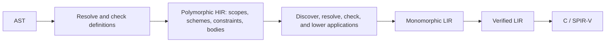

# Template implementation architecture

Status: proposed implementation of the [template language design](templates.md).
This changes the HIR contract and HIR-to-LIR lowering; it does not describe the
current compiler. Templates, contextual deduction, and editor analysis use the
same architecture as ordinary functions from the beginning.

## The retained program is polymorphic HIR

HIR stores definitions, their type schemes, and one typed body per definition.
Checking a use instantiates its scheme and establishes structural type relations.
HIR retains type constraints and dependent type computations; it does not describe
the set of supported monomorphs or append concrete function bodies. HIR-to-LIR
lowering discovers applications, resolves their concrete types, checks platform
support, and emits concrete LIR.



There are no additional public passes for a resolved program or checked instance
program. Name resolution and inference are private work inside HIR construction;
enumerating monomorphs is private work inside LIR lowering. The driver continues
to sequence the existing language boundaries.

The HIR guarantee becomes: names are bound, schemes and bodies are structurally
consistent, and dependent types have explicit determining expressions or relations.
It does not guarantee that every application is implementable on any platform.
Private solver state and unresolved lexical lookup do not survive construction.
The retained constraints are immutable language data. LIR construction must resolve
all requested types and reject unsupported concrete operations before publishing
a monomorphic module; verification then establishes the existing LIR guarantees.

This is a substantial redesign of [HIR](../crates/resin-hir/src/lib.rs), not an
extra template path attached to the existing concrete checker:

| Current arrangement | Proposed arrangement |
| --- | --- |
| A HIR function identifies one concrete signature and body | A definition identifies a scheme and one polymorphic body. |
| HIR owns the final concrete type and function tables | HIR owns source type families; LIR construction owns concrete output identities. |
| [Checked terms retain lexical cursors and names](../crates/resin-hir/src/lower/typed.rs) | Terms reference definitions and bindings directly. |
| [Elaboration repeats lexical lookup](../crates/resin-hir/src/lower/elaborate.rs) | Binding is completed during HIR construction; dependent lookup is an explicit typed operation. |
| [LIR copies HIR's tables and lowers functions one for one](../crates/resin-lir/src/lower/mod.rs) | LIR owns an application worklist, concrete type construction, and function emission. |
| Editor analysis retains construction contexts | Queries read immutable HIR scopes, schemes, and recorded use-site facts. |

## Scopes, definitions, and types

Give HIR its own definition, binding, scope, and source-node identities. A source
span is a diagnostic location, not a unique expression identity. Identities are
stable within an immutable program version; cross-edit identity is not required.
Retain the defining module and nominal namespace as explicit references.

An immutable scope records its parent, declarations, and their visibility order;
each definition carries its completed scheme. Retain the parent visibility point
where needed so editor queries do not expose later local bindings earlier in the
source. These are retained language data, useful for imports and editor queries.
Mutable scope builders, lookup cursors, recovery state, and solver
arenas remain private to construction. A body references a resolved definition
directly rather than asking a scope to reinterpret an identifier during lowering.
Dependent member lookup uses the eventual receiver's defining namespace, never
the caller's lexical scope.

HIR needs a type vocabulary distinct from concrete `resin_types::Ty`:

| Representation | Meaning |
| --- | --- |
| HIR type | A primitive, bound parameter, structural constructor, nominal application, or explicitly derived dependent type. |
| HIR scheme | Explicitly named quantified parameters and the definition's structural signature. |
| HIR type constraint | A relation between type expressions, or a determining operation whose concrete result is checked during specialization. |
| Private inference type | An unfinished equation term with variables owned by a definition-checking group or call deduction. |
| `resin_types::Ty` | A concrete type used for layout, representation, LIR, and backend operations. |

For example, `identity` has scheme `forall T. (T) -> T`; builtin addition has
scheme `forall T. (T, T) -> T`. Both establish relationships between operand and
result types without restricting which concrete `T`s have implementations. A
source `add<T>` needs no propagated `SupportsAdd<T>` predicate. Ordinary concrete
functions have schemes with no quantified parameters and use the same machinery.

Only explicitly named parameters are quantified. They remain rigid during
definition checking. Each `_` introduces a fresh weak, monomorphic type variable
into ordinary inference. There is no separate hole-solving mode, and no rule
generalizes an unresolved `_` into another template parameter. Repeated `_`
occurrences start independently and become equal only through actual constraints.

```resin
def do_something<T>(value: T) -> Result<_, String> = { ok(value) };
```

The anonymous result component unifies with the existing bound `T`, completing
the signature as `forall T. T -> Result<T, String>`. It is not another quantified
parameter. A weak variable may likewise resolve to a concrete type or a dependent
expression such as `MemberType(T, "member")`; that determining relation must stay
attached to it.

Runtime parameters, object fields, and local `var` storage have one type per
enclosing application. A local `_` joins constraints from the initializer and
uses; it does not instantiate a new type at each read. Anonymous variables in
function/type declarations do not create parameter lists either. Explicit type
applications refer only to named parameters in their written order. Foreign and
decorated shader signatures retain their fixed ABI requirements.

Applying a named scheme introduces fresh deduction variables for its named
parameters in the caller's HIR session. It does not freshen unresolved weak
variables from the definition. Deduction variables must resolve to concrete types,
enclosing bound parameters, or
determining type expressions. Private solver state is not retained in HIR, and
LIR never chooses a type for an unresolved weak variable.

```resin
def add<T>(left: T, right: T) -> T = { left + right };
def twice<U>(value: U) -> U = { add(value, value) };
```

The call in `twice` records `add<U>`. HIR contains one definition of each function,
regardless of how many concrete applications the eventual program needs.

## Type discovery and concrete checking

HIR checks signature relationships. For builtin addition, both arguments and the
result instantiate the same `T`; fixed incompatible argument types remain a
structural error. HIR does not enumerate the types for which addition exists.
`add<bool>` can therefore be structurally valid HIR and still fail when LIR
construction requests the unsupported concrete operation. Platform availability
is not encoded as a constraint propagated through every caller's scheme.

Some operations have a result type determined by the receiver's eventual
definition. Retain explicit type-producing operations and their relationships:

| Expression or operation | Information retained in HIR |
| --- | --- |
| `left + right` | The builtin declaration, applied signature `(T, T) -> T`, and operands. |
| `value.member` | The receiver, member selection, derived field type, and required access category. |
| `value.method(args)` | Receiver and argument terms, defining-namespace lookup, and derived parameter/result types. |
| A literal whose type depends on `T` | Exact magnitude/sign, numeric kind, and its expected type expression. |
| A layout query involving `T` | The operation and its type argument, without a concrete layout. |
| A conversion or branch join | The source/target type relation or a deterministic derived result. |

These are immutable constraints and expressions, not arbitrary deferred AST or
resumable inference callbacks. HIR can simplify known structural facts: accessing
`Pair<T>.left` already has type `T` and a known field identity. Otherwise the
operation remains in HIR for resolution during LIR construction.

```resin
def field<T>(value: T) -> _ = { value.member };
```

The result variable is determined by `MemberType(T, "member")`. It must not become
an independently quantified caller-selectable result. After substituting a
concrete receiver type, LIR reads its declared field type and checks the retained
relations. A missing field or incompatible expected type is a specialization
error. Reading a known declaration and comparing concrete types is resolution
and checking, not inference of another polymorphic argument.

Likewise, `value.take(1)` may retain a literal whose expected type is the selected
method's parameter. A concrete method taking `int` determines an `int` literal;
one taking `ulong` determines `ulong`. HIR must not default that literal while its
producer is still dependent. If the selected method has its own type parameters,
HIR must have already recorded their substitution. While lookup is fully
dependent, use explicit method arguments such as `value.take<int>(1)`, or annotate
the receiver sufficiently for HIR to resolve the method and deduce its arguments.
Matching concrete operands to a newly discovered generic signature would still
be deduction, even if the answer is unique; LIR does not do that work.

The boundary is precise: HIR performs unification, deduction, and numeric defaulting.
LIR substitutes chosen arguments, evaluates determining type
expressions, and checks ground relations. An assignment of a new type to a free
metavariable would be inference and is not permitted in LIR construction.

Dependent access also records whether the source requests a read, assignment, or
address. LIR checks field selection, receiver adaptation, place category, and
read/write legality, preserving runtime access checks for GPU-backed pointers
and spans. It cannot derive those decisions from a member name alone.

## Scheme inference and contextual literals

Check definition dependency groups and complete their schemes before publishing
them to unrelated callers. A call instantiates a completed scheme; it cannot
mutate the definition's inference session. Within a recursive group, solve the
group's structural equations together, keeping bound parameters distinct. Incoming
caller constraints instantiate the published named parameters instead of mutating
the definition's weak variables or inventing an inferred signature.

Each recursive reference carries its type-argument substitution. Being in one
dependency group does not equate distinct binders or make `f<T>` and `f<Ptr<T>>`
share one instantiated result variable. Solve equations over the definitions'
symbolic signatures and their applications. A dependent result computation must
retain its producer; a free weak result variable cannot become a quantified
parameter just to complete the scheme. Bound expanding applications during LIR
construction.

An inferred result can normalize to a useful pattern:

```resin
def identity<T>(value: T) -> _ = { value }; // completed result is T
def plain() -> _ = { 1 };                 // completed result is long
def total() -> int = { identity(42) };     // identity<int>
```

Deduction uses the completed result shape, whether declared or inferred once.
`plain` completes to `() -> long`; a caller cannot turn its `_` into a new type
parameter. A concrete annotation or a body such as `int(1)` fixes the result
directly. `identity` still exposes result `T`, even though that relationship was
established by unification rather than written as its result annotation.
Opaque member-result or other non-invertible type computations cannot be used
backwards to guess a missing type argument. The checker never searches for a
type whose instantiated body happens to succeed on the target.

Finite instance discovery does not resolve an unconstrained weak result:

```resin
def looped() -> _ = { looped() }; // weak R = R has no determining type
```

This needs a determining annotation; it does not become `forall R. () -> R`.
Reusing one worklist entry supplies no missing type. If a requested application's
signature or body still contains an unknown after substitution and normalization,
report an annotation error before emitting LIR for it. No unknown is generalized,
defaulted arbitrarily, or chosen by LIR to break the cycle. The same rule applies
to cyclic derived results with no concrete determination.

One call-checking path handles ordinary functions, templates, methods, and
compiler-provided operations:

1. Apply explicit type arguments and match already determined argument types
   against parameter patterns. Leave unsuffixed literal constraints flexible.
2. Use an available expected result to fill remaining parameters through the
   completed result pattern. Preserve equality, deduction, and conversion as
   distinct relations; expected context must not overwrite fixed arguments.
3. Propagate constraints through nested calls, aggregates, and later uses of
   local bindings. Simplify available structural type expressions and retain
   dependent relations in HIR, with explicit type producers.
4. After productive dependencies settle, default eligible unconstrained numeric
   components to `long` or `float64` in HIR and record their selected types.
   Unresolved nonnumeric variables require a determining annotation. Concrete
   range checking cannot retry a wider type or another monomorph.

Keep literal payloads exact until their type is known. A literal connected to a
bound parameter retains that expected type; it is not an unconstrained number
eligible for fallback. A literal independent of bound parameters defaults while
completing the definition. A weak variable with no numeric origin, such as
`looped`'s result, has no invented numeric default. An explicitly named
`increment<T>(value: T) -> T = { value + 1 }` remains polymorphic; replacing its
annotations with unrelated `_` variables does not declare a template.

Completed schemes remove many apparent instance-scheduling dependencies:

```resin
def value<T>(unused: T) -> _ = { int(3) };

def example() -> _ = {
    var n = 1;
    var x = value(2);
    n := x;
    n
};
```

`value` already has result `int` in its scheme. The assignment selects `int` for
`n` and the enclosing result; the independent argument `2` defaults to `long`.
There is no need to build `value<long>` before learning its return type. Likewise,
`var n = identity(1); n := value(2);` selects `identity<int>`.

Some expected types genuinely need a concrete receiver first. HIR represents them
as determining expressions, such as a field type or method parameter type, rather
than prematurely defaulting their literals. Relations that HIR cannot settle
must be fully determined by chosen arguments and these expressions at LIR
construction. There is no later fallback or candidate search. A case requiring
new deductions at that boundary needs an explicit annotation or type argument.

For `Result<T, _>`, `_` is the same ordinary anonymous variable. Propagation relates
it to the least union of produced error types; that union can contain bound
parameters or dependent type expressions. HIR records the union computation and
LIR normalizes its concrete constituents and checks Result's error-type rules.
An empty completed union is `Never`. A determining error-union relation is not
discarded in order to generalize a fresh unconstrained error parameter. Recursive
relations must resolve to a concrete error type for the requested application;
unresolved contributors cannot be treated as empty.

An input error variable must not become `Never` merely because it occupies a
Result slot. `def carry(value: Result<_, _>) -> _ = { value };` does not declare
two anonymous template parameters; its unresolved components need annotations
or explicitly named parameters. An unconstrained empty array's element variable
likewise needs a determining type rather than implicit generalization.

## Specialization belongs to HIR-to-LIR lowering

[LIR lowering](../crates/resin-lir/src/lower/mod.rs) owns a worklist keyed by HIR
definition, normalized concrete substitution, and semantic target profile. The
substitution includes named parameters, nominal owner arguments,
and any enclosing generic arguments. Normalize aliases and derived argument types
before comparing keys, so a field type that resolves to `int` reuses an explicit
`int` application. Preserve nominal origins without recursively expanding their
fields just to compare identities.

HIR has no interned concrete type catalog. It retains structural type expressions
and nominal applications. LIR construction owns concrete type normalization,
interning, layouts, and all application memoization. Incomplete nominal identities
used to close pointer recursion are private construction state, not published
partially checked LIR.

The worklist does the following:

1. Seed the requested concrete host/shader entries in their semantic profiles.
   Propagate each profile through calls and required operations. A shader-only
   helper must not receive an unrelated host request merely because it exists.
2. Substitute and normalize the application's arguments. A remaining unknown
   produces an annotation diagnostic; there is no LIR deduction session.
3. Look up the complete key. For a new key, check the per-function allowance,
   reserve its identity, and enqueue it. Recursive references reuse pending
   identities instead of recursively generating another body.
4. Resolve its determining type expressions and check concrete signature
   relations, fields, conversions, literals, and builtin implementation support.
   Every body type must become concrete before storage for it is emitted.
5. Lower storage, evaluation, copies, cleanup, and structured control flow.
   Calls and implicit operations request additional worklist entries. A private
   temporary checked body is fine; discard it after lowering.
6. Once discovery is complete, perform checks needing the complete call graph,
   including shader recursion and reachable host-only operations. Return complete
   monomorphic LIR or diagnostics, then run the existing LIR verifier.

Calls are not the only references. Function values, shader artifacts, pipeline
bridges, compiler operations, and implicit drop hooks also request functions.
Preserve source evaluation order and evaluate runtime arguments exactly once.
No worklist operation executes Resin initializers at compile time. Use stable
request order and retain requesting locations separately from canonical keys.
Memoize type normalization and concrete operation/signature results within this
LIR construction run; do not cache mutable inference sessions in HIR.

Concrete checking belongs in a substantial private LIR lowering operation, using
the concrete rules in `resin-types`. HIR exposes its symbolic language and ordinary
structural queries; it does not expose a concrete instance checker that lowering
calls back into. LIR never reparses source or repeats lexical name resolution.
The two phases check different guarantees: structural scheme consistency first,
concrete type and implementation validity second. Neither requires a parallel
ordinary-function path or a new public whole-program representation.

The target profile participates in checking. Host success for an application
cannot suppress shader validation of managed values, foreign calls, or recursion.
Profiles describe semantic differences in stage/capability support, not individual
entry-point identities. Identical concrete LIR bodies may be shared across profiles,
but each required profile has its own memoized validation result. The complete
call-graph checks run after worklist discovery; a visited flag is not a proof of
device validity. Code generation consumes only the resulting verified LIR.

Make requested entries and profiles explicit compilation inputs. Today entry
selection happens after `Compiler::compile`, in code generation; move the relevant
request into compilation so lowering knows which platform checks are required.
Canonicalize and deduplicate requests for deterministic scheduling and cache
matching. Editor declaration analysis can request HIR without a LIR artifact,
rather than an empty module presented as target-validated output; concrete
diagnostics require the corresponding target request. Code generation must not
silently select an entry/profile absent from the validated compilation.

Host `.spirv` and pipeline operations add shader-profile roots for their referenced
entries. They do not move host allocation, bridge creation, or recording code
into the shader graph. Keep structural diagnostics for all definitions in HIR.
Run source-level initialization checks that do not depend on concrete storage on
all definitions in that checking stage, while checking dependent places during specialization.
This avoids using unconditional code emission to preserve unrelated diagnostics.

## Bounded monomorph generation

Add `CompilerConfig.max_monomorphs_per_function`, defaulting to `16 * 1024`
(16,384), using `NonZeroUsize` so invalid zero configuration is unrepresentable.
[Compiler](../crates/resin-compiler/src/lib.rs)
currently has no configuration object; retain `Compiler::new()` with defaults
and add `Compiler::with_config(config)`. Store configuration immutably on the
compiler. Pass the relevant setting through LIR-owned lowering options, without
making `resin-lir` depend on `resin-compiler`. A fixed configuration preserves
the current compilation-cache reuse rules; mutable or per-call configuration
would have to participate in cache matching. Requested entries/profiles already
participate independently as described above.

The allowance counts distinct memoized requests for each original HIR function
definition across the whole compilation. A request includes its normalized full
substitution and semantic target profile. Different profiles count separately
even if their emitted bodies can later be shared. Owner or enclosing substitutions
do not reset a method's allowance, and compiler-generated helpers retain a stable
origin rather than manufacturing a fresh budget for every application.

Apply the limit after canonical lookup and before reservation. Existing requests,
including recursive references, repeated imports, and additional entry roots,
cost nothing. A new reserved request counts even if checking later fails. With
the default, allow requests 1 through 16,384 and reject request 16,385 before
inserting it. Report the function, configured limit, attempted arguments/profile,
and requesting chain. Store predecessor edges and render a bounded trace rather
than copying an expanding trace into every work item. Counters belong to one
construction run; reusing a completed compilation consumes no new allowance.

Memoization handles repeated keys, not an infinite sequence of distinct types:

```resin
def grow<T>(value: T) = { grow<Ptr<T>>(&value); };
def main() = { grow<int>(0); };
```

This requests `grow<int>`, `grow<Ptr<int>>`, and so on. The allowance terminates
discovery with a diagnostic; it does not prove that every structurally typed
program has a finite successful specialization. For a finite set of definitions
and profiles, admitted function requests are bounded by the aggregate allowances.

This cap does not bound every compiler operation. Alias cycles, derived-type
normalization before a key exists, growing nominal applications, and structural
type-size expansion need separate internal cycle/expansion safeguards. Concrete
expansion guards belong to LIR construction; HIR's structural alias simplification
and unification still need ordinary cycle, occurs, and depth checks. Report the
actual cause. Do not silently make
the function-count setting mean a type-depth limit, or claim that 16,384 alone
is a total time or memory bound.

## Concrete types, methods, and lifecycle

HIR retains nominal declarations, field types, method namespaces, and drop
declarations. A nominal application is identified by its definition and arguments,
including enclosing generic arguments for any local nominal declaration. Thus
the local type of `f<int>` is distinct from the corresponding type of `f<float32>`.
Transparent aliases normalize to their targets without changing nominal origins.
Deduction uses those origins, never names or equivalent record layouts.

LIR construction owns the canonical mapping from closed nominal applications to
the final `TypeId`s. Reserve identities for recursive types, resolve fields and
hook signatures, reject infinite inline layouts and alias cycles, and publish
complete concrete definitions. A method can inspect completed owner fields
without waiting for every method body to finish.

Lifecycle classification must know both fields and drop declarations. Reserve
the real LIR function identity for a required drop application before installing
its concrete hook metadata. A pending hook body does not make its owner unmanaged.
Copy/drop and GPU-admissibility queries must not observe placeholder hook IDs or
a temporary `drop = None` used to break a construction cycle.

`resin-types` remains independent of HIR and owns concrete layout and conversion
rules. LIR construction uses those rules and its concrete catalog directly. HIR
uses its symbolic type vocabulary; it does not create a temporary concrete catalog
and translate its IDs back into symbolic types. This applies to every type-bearing
payload, including conversion descriptions, fields, type values, and aggregate
constants. No concrete `Ty` is extended to contain unresolved variables, and the
concrete types crate does not learn about source declarations or schemes.

Source functions, foreign declarations, and compiler-provided methods share
scheme application and argument checking. Their implementations remain explicit
alternatives: source body, foreign declaration, or compiler operation. Builtin
registration stays in [HIR context construction](../crates/resin-hir/src/lower/context.rs).
Operations requiring decorated shader identity retain that domain fact; this
does not introduce general value parameters. Intrinsics that must execute at
the call site remain inline operations during specialization and LIR lowering.
GPU allocation and pipeline projection use these same checked signatures.

## Diagnostics, imports, and immutable analysis

Source exports identify definitions, including template families. Executable
entries and decorated shader entries select concrete signatures initially.
Imported definitions retain access to resolved private helpers in their defining
module. The same application requested through different importers has one LIR
identity. Templates must not be flattened into arbitrary concrete exports.

Report syntax, binding, and structural inference errors during HIR construction.
Concrete operation, unresolved-type, platform-support, and monomorph-limit failures
belong to LIR construction. Each failure carries its source location and the
applications/profiles that required it. An unused family need not have a valid
monomorph on every platform; requesting an unsupported one must fail before a
successful LIR result. Preserve separate phase errors instead of a shared enum.

The [compiler's current error mapping](../crates/resin-compiler/src/lib.rs)
indexes HIR functions with a LIR function ID. Remove that assumption: one HIR
definition can now produce several LIR functions. Lowering diagnostics need
their source origin and specialization trace directly. `Compilation.hir()` can
retain the polymorphic program even if a required LIR specialization fails.

Editor queries read declaration schemes and completed use-site application facts.
A source expression in a template has a symbolic type; a concrete use may have
an instantiated signature. Keep use-site facts separate from definition facts,
keyed by source-node identity and application as appropriate. Never overwrite a
generic expression's type with the last specialization inspected. Completion for
an unconstrained parameter cannot invent members from an unrelated application.

Keep construction solvers and temporary semantic request tables out of retained
analysis. Recover failed constraints without publishing speculative deductions
into healthy facts. Freeze completed HIR and analysis together; hover, completion,
and navigation do not enumerate monomorphs or mutate old results. Preserve the
compiler's immutable source/compilation cache and reload the import graph before
reusing a result after edits.

## Implementation layout and migration

Keep the public languages and operations in each crate's `lib.rs`. HIR's private
`lower` modules own AST translation, binding, named schemes, and weak-variable inference.
LIR's private `lower` modules own substitution, concrete checking, the application
worklist, concrete identity maps, and storage lowering. These
are cohesive responsibilities, not a mandate for many small forwarding modules.

1. **Introduce the HIR model for ordinary programs.** Store immutable scopes,
   resolved references, symbolic type constructors, and completed schemes with
   empty parameter lists. Move editor queries onto those facts. Remove lexical
   re-lookup during elaboration and keep private inference state out of HIR.
2. **Move concrete identity and emission into LIR lowering.** Replace one-for-one
   function traversal and table copying with the application worklist. Give
   diagnostics direct origins. Establish concrete checking on ordinary definitions,
   explicit target requests and cache matching, platform validation, and the
   configurable monomorph allowance. Preserve independent initialization diagnostics
   without forcing every helper into a host specialization.
3. **Enable function templates and contextual deduction.** Add syntax, bound
   parameters, ordinary weak-variable inference, and dependent type constraints.
   Instantiate schemes at uses and remove the separate hole-inference mechanism.
   Ship imports, completed result patterns, suffix-free literals, and editor
   analysis together; LIR resolves ground types without running inference again.
4. **Enable nominal and method templates.** Add family applications, aliases,
   owner substitution, and specialized destruction hooks. Reuse the same scheme
   application rules for source methods and compiler-provided operations.

Each step leaves ordinary programs usable and replaces the relevant old path.
Do not keep a separate ordinary-function checker as a compatibility architecture.
The implementation must update the HIR contract in the architecture guide and
repository instructions when the new boundary actually ships.

Boundary tests should establish that HIR retains one body per definition, contains
no solver arena, concrete type catalog, or emitted monomorph table, and can be
lowered after construction state is discarded. Verify `_` variables never
generalize, can unify with bound named parameters, and relate to separate `_`
occurrences only through real constraints. Local storage stays monomorphic and
symbolic member results keep their determining operations. Completed result patterns guide
deduction, numeric defaults remain predictable, and union/Result widening works.
Exercise shadowing, distinct nodes with equal spans, recursive schemes and growing
applications, instance reuse across imports, and local nominal origins.

Test a small configured allowance at its exact boundary: duplicate requests and
ordinary recursion reuse entries; the next distinct request fails before insertion.
Include owner arguments, different target profiles, failed requests, and distinct
compiler configurations. Test unresolved concrete types as errors, not inferred
fallbacks, and prove that a cached host result cannot bypass shader validation.

Check failure recovery and old editor results after edits. Verify monomorphic
LIR's complete function/type/drop mappings, including implicit references. Run
end-to-end C and direct shader-helper examples with ownership-sensitive arguments,
rejected managed GPU values, recursive shader rejection, argument evaluation
counts, and native ABI checks. Backends should need no template-specific rules.
