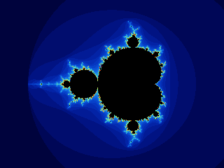

# 2. Draw an image

Each pixel represents a small region in the complex plane. Use one sample for
now: map its position to `c`, find the escape count, and choose a color. An image
visualizes those counts; black means that the finite test found no escape.

## Map coordinates without stretching

Our initial view is centered at `(-0.5, 0)`, with a vertical span of three. Use the
same scale on both axes so rectangular windows do not distort the fractal. Screen
`y` points down; the imaginary axis points up:

```resin
{{#include ../../examples/tutorial/fractal.resin:coordinates}}
```

A sample position such as `(x + 0.5, y + 0.5)` is measured in pixels. The checkpoint
uses the first point in the sampling table, `(0.5, 1/3)`, even at one sample per
pixel; [the next chapter](sampling.md) explains the table. This keeps every quality
level a prefix of the same sequence.

## Give counts a color

Keep iteration and coloring separate. This palette reserves black for zero and
repeats blue-to-gold bands for escaped points:

```resin
{{#include ../../examples/tutorial/fractal.resin:palette}}
```

`Color` is a small struct of four `float32` channels. A struct initializer names
each field with `field = value`. This palette is deliberately simple: it shows
integer escape bands. Supersampling can smooth spatial edges, but does not remove
those color bands.

## Own the pixels, borrow the view

Allocate an `ArcSpan<ubyte>` for tightly packed RGBA bytes. Its owner releases the
allocation when its last owning handle is dropped. `pixels:get()` borrows a
`Span<ubyte>` descriptor; it does not retain the allocation. Keep `pixels` alive
while using the view.

```resin
{{#include ../../examples/tutorial/fractal.resin:render}}
```

`view:at(index)` returns `Ref<ubyte>` and assignment writes that element. It does
not move the buffer or produce a pointer. Host indexing checks bounds before
returning the reference. The channel index is `4 * (y * width + x)`; multiply after
converting dimensions to `ulong` to avoid doing the arithmetic at `uint` width.

This checkpoint fixes the iteration budget at 256 in `evaluate_pixel`; it accepts
1–16 samples. For now, passing one makes the pixel evaluator do just one orbit.

`ArcSpan<ubyte> | Err<_>` is a union of success and failure. Allocation returns the
owner directly on success. Postfix `?` propagates an `Err` from the current
function and yields the ordinary value otherwise. `_` lets this definition infer
the error payload. There is no `Result` wrapper or `Ok` constructor. See
[unions and errors](../errors.md).

## Write a PNG

The checkpoint passes the byte view to the image library. Four channels mean
RGBA; a zero stride requests tightly packed rows:

```resin
{{#include ../../examples/tutorial/02_image.resin:image}}
```

Run it and open the resulting file:

```sh
cargo run -- examples/tutorial/02_image.resin
```

The file is `mandelbrot-1.png` in the working directory. This CPU path needs no
window or GPU. The path literal's `.data` is already a pointer to static,
NUL-terminated bytes; it is not the address of a local string descriptor.


