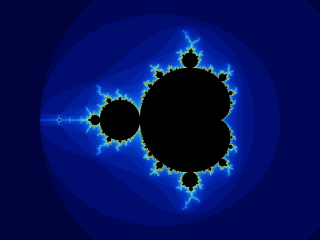

# 3. Sample between pixels

Near the boundary, nearby coordinates can have very different escape counts.
Sampling only one location can miss a thin feature or make an edge look jagged.
Supersampling evaluates several locations inside each pixel and averages their
**colors**. Averaging iteration counts first would produce a different picture
because the palette is nonlinear.

## A small Halton table

For integer sample index `n`, reverse its digits after the radix point, once in
base two and once in base three. For example, `3 = 11₂` gives `0.11₂ = 3/4`, while
`3 = 10₃` gives `0.01₃ = 1/9`. Together they give `(3/4, 1/9)`.

These pairs form a Halton sequence. Its small prefixes spread samples through the
pixel without a regular square grid. Precompute indices 1 through 16:

```resin
{{#include ../../examples/tutorial/fractal.resin:halton_samples}}
```

The array contains tuples; `.0` and `.1` select their components. The compiler
infers the array result type from the function body. For more background, see
[PBRT's Halton sampler](https://pbr-book.org/4ed/Sampling_and_Reconstruction/Halton_Sampler).

## Average incrementally

For sample number `k`, starting at one, update the running mean with
`mean + (sample - mean) / k`:

```resin
{{#include ../../examples/tutorial/fractal.resin:blend}}
```

The pixel evaluator connects coordinate mapping, iteration, palette, and blend:

```resin
{{#include ../../examples/tutorial/fractal.resin:pixel}}
```

Notice that the local array supports `offsets:at(...)`. A local array needs no
heap allocation to read or mutate its elements. It cannot expose a pointer with
`:lea`; the next chapter explains that distinction.

Run the 16-sample checkpoint:

```sh
cargo run -- examples/tutorial/03_sampling.resin
```

It writes `mandelbrot-16.png` with the same dimensions and view as chapter two.
Compare the two files at their native size:



The tutorial materializes the small table inside `evaluate_pixel` for simplicity.
The complete explorer creates it once, keeps it alive in an owner, and lends the
selected prefix to the evaluator. On the GPU it uploads the table once too.

## Understand the cost

The upper bound on iteration work is
`width × height × samples × iteration_limit`. Most exterior points escape early;
the complete solver also recognizes two known interior regions. Nevertheless,
sixteen samples can be substantially more expensive than one. More samples improve
spatial coverage; more iterations improve the finite escape test. Neither adds
floating-point precision or guarantees the exact mathematical image.

The interactive application uses one sample while the view changes, then renders
again at the selected quality when input settles. That policy belongs in the
application, leaving the pixel evaluator deterministic.
