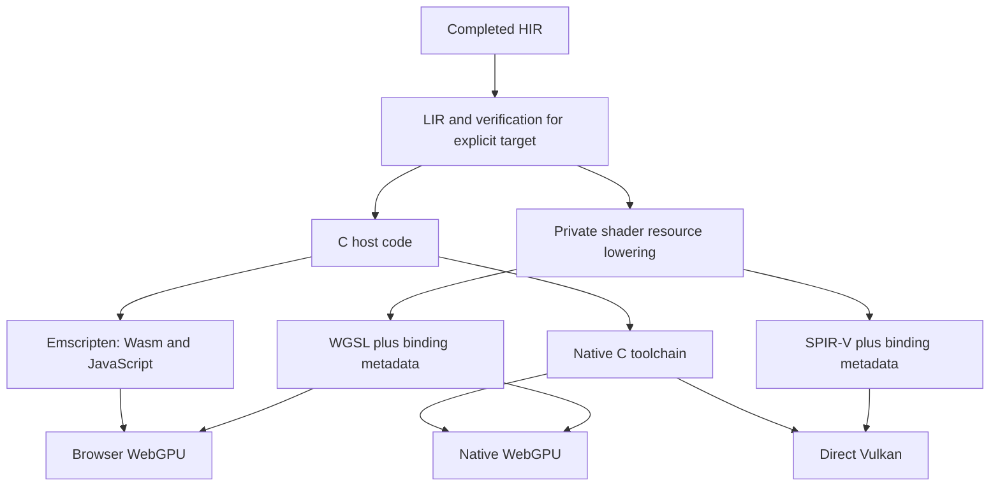

# Browser-first WebGPU migration

Status: proposed implementation plan, not implemented. Reviewed against Resin
`9b4ccc02` on 2026-09-16. Browser execution is the first deliverable; native
Linux/macOS/Windows WebGPU follows. Retain direct Vulkan as an explicit backend.

The target is one Resin programming model for compute, rasterization, and inline
ray queries. Ordinary structs describe shader resources. WebGPU is the default
GPU backend, with software ray traversal on devices without a supported hardware
path. This requires a browser host target as well as a GPU backend.

## Recommended decisions

- Keep C host emission. Compile browser programs to Wasm32 with Emscripten.
  Keep compilation on the existing Resin server; deployed programs run in the
  browser without contacting the compiler. An in-browser compiler/editor is a
  separate project.
- Emit standard WGSL directly from verified LIR for WebGPU. Retain direct
  SPIR-V emission for Vulkan. Existing physical-address SPIR-V is not a suitable
  input to a portable shader translator.
- Use the common `webgpu.h` interface: Emdawnwebgpu in browsers and Dawn on
  native platforms. Keep the Rust runtime and expose its existing C-facing
  operations. Validate Rust/C/Emscripten linking in the first milestone before
  investing in the complete backend.
- Derive resource layouts and binding operations from ordinary shader-root
  structs, following Blade's shader-data approach. Generate WebGPU bind groups
  and Vulkan descriptor sets from the same completed binding description.
- Implement triangle ray queries in Resin compute code first. Add Vulkan
  acceleration structures and hardware ray queries after the software contract
  has differential tests. Backend choice and ray-traversal choice are separate.
- Preserve ownership, checked host GPU access, typed pipelines, and recording
  lifetime rules. Make the browser's suspension points explicit in the runtime
  contract while preserving sequential Resin source execution initially.

## What the current implementation assumes

| Area | Current implementation | Required change |
| --- | --- | --- |
| Shader addressing | `spirv/mod.rs` emits `PhysicalStorageBuffer64`; `spirv/entry.rs` passes a 64-bit root address through push constants | Generate resource bindings and logical offsets for portable shaders |
| Device selection | `runtime/src/gpu/device.rs` requires Vulkan 1.3, shader int64, buffer device addresses, and other Vulkan features | Browser adapter negotiation and explicit portable feature/limit checks |
| Projection | `codegen/src/c/lower/projection.rs` allocates a root and writes device addresses through the runtime | Produce scalar metadata and retained resource bindings |
| Host layout | `resin-types/src/types.rs` assumes eight-byte host pointers; runtime `lib.rs` rejects non-64-bit desktop targets | Explicit host target layout and Wasm32 runtime support |
| Transfers | GPU views use mapped host memory; submission waits synchronously | Staging, asynchronous completion, and browser event-loop integration |
| Presentation | GLFW creates native windows and Vulkan surfaces | Canvas surface and browser input/lifecycle adapter |
| Build service | Protocol artifacts are executable/SPIR-V; server builds its installed host target | Negotiated browser target and downloadable web bundle |
| Ray tracing | `doc/design.md` lists acceleration structures and ray queries as future work | Introduce the API and both software/hardware implementations |

The existing source API already helps: `GpuView` retains an owner and offset,
typed pipelines retain root/stage identities, and launch projection does not
traverse arbitrary pointer graphs. Keep those boundaries.

## Ordinary structs as resource layouts

Blade was inspected at
[`6ab5fcec7ba159cbbb1065191f9a9838f4b34b6a`](https://github.com/kvark/blade/tree/6ab5fcec7ba159cbbb1065191f9a9838f4b34b6a).
Its [`ShaderData` derive](https://github.com/kvark/blade/blob/6ab5fcec7ba159cbbb1065191f9a9838f4b34b6a/blade-macros/src/shader_data.rs)
walks named fields in declaration order, emits a layout containing names and
binding kinds, and emits the code that binds each field. Resource field types
and plain data select different binding kinds through
[`HasShaderBinding`](https://github.com/kvark/blade/blob/6ab5fcec7ba159cbbb1065191f9a9838f4b34b6a/blade-graphics/src/derive.rs).

Blade's [shader processing](https://github.com/kvark/blade/blob/6ab5fcec7ba159cbbb1065191f9a9838f4b34b6a/blade-graphics/src/shader.rs)
matches used shader globals to those field names, assigns group/binding indices,
checks resource kinds, and combines stage visibility/access information. The
[Vulkan command implementation](https://github.com/kvark/blade/blob/6ab5fcec7ba159cbbb1065191f9a9838f4b34b6a/blade-graphics/src/vulkan/command.rs)
fills descriptors and binds a set. The user supplies a struct value rather than
manually assembling a descriptor update.

Resin controls both the host and shader languages, so it can generate both sides
from one resolved declaration without a derive macro or runtime name matching.
The struct describes the resources; its host object bytes are not a descriptor
set and are not blindly copied into shader storage.

For example, retain the existing style of shader roots:

```resin
struct ScaleArgs {
    input: Span<float32>,
    output: Span<float32>,
    factor: float32,
};

@compute_shader
def scale(index: ulong, args: Ptr<ScaleArgs>) = {
    if (index < args.input.length && index < args.output.length) {
        args.output.at(index) := args.input.at(index) * args.factor;
    };
};

// Inside a host function, with imports and resources supplied:
var pipeline = gpu.create_compute_pipeline(scale)?;
commands.dispatch(pipeline, {
    input = source,
    output = destination,
    factor = 2.0_f,
}, groups, 1, 1)?;
```

The proposed portable layout for this example is:

| Group | Binding | Meaning |
| --- | --- | --- |
| 0 | 0 | Packed launch constants: factor, lengths, and view-offset metadata |
| 0 | 1 | Input storage buffer, read-only |
| 0 | 2 | Output storage buffer, read/write |

The host values for `input` and `output` are owning `GpuSpan<float32>` views,
as in today's projection. Shader code continues to see borrowed spans. Ordinary
scalar fields are gathered into one generated constants block to avoid spending
a binding on every scalar. A struct used only as buffer payload remains plain
data; interpreting it as a binding description is specific to a pipeline root.

Start with one group per root and flatten nested resource fields in declaration
order, retaining their full field paths for diagnostics and identity. Keep binding
numbers deterministic and preserve unused declared slots for layout compatibility.
Combine access/stage requirements across the reachable shader graph and both
graphics stages. Give a resource-free root an appropriate constants-only layout;
give a rootless shader an empty layout. Explicit reusable groups for frame,
material, and object data can follow when there is a concrete need.

Complete a binding plan during target lowering with resource kind, element
layout, field path, access, stage visibility, minimum binding size, scalar packing,
and logical-view metadata. Compiler-known operations determine read/write use;
unknown access is conservative. Host view permissions must authorize the completed
plan. Launch scalar fields are read-only in the portable profile; diagnose writes
to the launch record itself rather than silently changing their meaning.

The runtime validates device ownership, ranges, alignment, stage limits, and
aliasing before recording. WebGPU has usage-scope restrictions on writable aliases:
the first version rejects conflicting multiple bindings of one allocation with a
clear error, and in-place kernels use one shared binding. Do not duplicate storage
to hide aliases. Later alias support must canonicalize bindings and preserve actual
sharing. A bind-group cache may follow correctness work; cache keys must include
layout, resource generations, ranges, and access, and cached groups retain owners.

Blade is an API-design reference, not the proposed runtime dependency. Its current
[browser path is WebGL2](https://github.com/kvark/blade/tree/6ab5fcec7ba159cbbb1065191f9a9838f4b34b6a#platforms),
and its [ray-query shader](https://github.com/kvark/blade/blob/6ab5fcec7ba159cbbb1065191f9a9838f4b34b6a/examples/ray-query/shader.wgsl)
uses `wgpu_ray_query`. That example does not establish standard browser WebGPU
ray-query support.

## Compiler and representation boundaries



Keep HIR target-independent. Add explicit target/layout inputs where concrete
representations are selected. `sizeof` remains a type query until the target is
known. `resin-types` owns concrete layout and numeric rules without importing
backend APIs. LIR construction and verification certify the selected shader
profile; target lowering in `resin-codegen` owns resource representation and
WGSL-specific restrictions. Keep target representations private and expose the
small completed artifact contract from `lib.rs`.

Store the profile in the LIR build key and the verification certificate, and count
profile-specific instances against the existing function specialization allowance.
No WebGPU pipeline may consume a module verified only for the Vulkan profile.

Add a private resource-oriented intermediate form only for the work that needs
it: shader pointers become a statically identified resource plus a checked logical
offset, while function-local places remain local. Preserve resource provenance
through helpers, indexing, branches, and returned references. Specialize helpers
by resource origin where needed; diagnose unsupported dynamic origin merges in
the initial subset. Never infer a resource from an integer address. Preserve the
existing ban on pointers embedded in GPU buffer elements.

Keep structured `If`/`Loop` regions through WGSL emission, including merge,
continue, failure, and early-return behavior. Validate generated WGSL with a
standard validator and actual browsers. Do not bypass uniformity validation or
introduce nonstandard WGSL extensions into the portable target.

Representation decisions requiring dedicated tests:

- **Wasm host ABI:** native pointers and function-table references use the
  target's layout. `long` and `ulong` remain 64-bit language integers on Wasm32.
  Audit strings, spans, shared owners, unions, Results, callbacks, foreign calls,
  and `sizeof`; do not implement this by changing every eight-byte field to four.
  Runtime ABI lengths and pointer-sized fields need explicit conversion rules
  with checked narrowing. Generate C/Rust size, alignment, and offset checks.
- **Shader integers:** baseline WGSL has `i32`/`u32`, not Resin's general
  `long`/`ulong` arithmetic. Keep current source semantics using two-word software
  lowering for reachable 64-bit operations, with proven narrowing only as an
  optimization. Start the spike with 32-bit payloads, then cover comparisons,
  arithmetic, shifts, division/remainder, conversions, and indexing before claiming
  compatibility. Preserve widened invocation-index arithmetic. `float64` remains
  unsupported in the portable shader profile with a source diagnostic.
- **Buffer layout:** preserve Resin's defined pointer-free payload byte layout
  using generated word loads/stores where direct WGSL types do not match it.
  Pack launch constants separately according to their WGSL layout. Wasm host
  layout, GPU storage layout, and binding metadata are distinct contracts.
- **Bytes:** byte arrays cannot simply become `array<u32>` with a different
  stride. Packed reads extract bits; concurrent byte writes sharing a word need
  an atomic compare/exchange implementation or an explicit unsupported diagnostic.
  All accesses to a binding must agree on its atomic representation. Test adjacent
  writes, unaligned records, array tails, and logical lengths. This is a parity
  gate, not a promise that packing is free.
- **Bounds and limits:** retain logical slice offsets when binding offsets must
  be rounded down to alignment. Include the adjustment in metadata and verify the
  enlarged range. Empty views bind valid inert storage but have zero logical length.
  Check overflow, buffer/binding sizes, and workgroup limits before use. Physical
  allocations may have padding; it is never part of the logical value.

These constraints follow the standard [WGSL type and layout rules](https://www.w3.org/TR/WGSL/)
and [WebGPU resource/usage rules](https://www.w3.org/TR/webgpu/). Device-dependent
features remain opt-in. Avoid a bindless descriptor array or a single unbounded
storage heap as an implicit portability requirement.

## Browser host and runtime

Use Emscripten for generated C and build the reusable Rust runtime portions for
`wasm32-unknown-emscripten`. Gate `ash`, GLFW, native allocation code, and OS-only
operations behind target/backend features. Pin the Rust toolchain, Emscripten,
WebGPU headers, and Dawn/Emdawnwebgpu together: Rust's
[Emscripten target documentation](https://doc.rust-lang.org/rustc/platform-support/wasm32-unknown-emscripten.html)
calls out toolchain ABI compatibility. The spike must prove linkage, ownership
callbacks, error returns, memory growth, and suspension across C/Rust frames.

[Emdawnwebgpu](https://dawn.googlesource.com/dawn/+/refs/heads/main/src/emdawnwebgpu/pkg/README.md)
implements `webgpu.h` over browser WebGPU and provides an Emscripten port.
[Native Dawn](https://dawn.googlesource.com/dawn/+/refs/heads/main/README.md)
implements the same interface over platform APIs including Metal, D3D12, and
Vulkan. Keep private Rust FFI bindings to the required C API and a narrow browser
adapter for canvas/events. This adds a pinned external build dependency but avoids
maintaining separate browser-JavaScript and native-Rust GPU implementations.
If the first spike cannot make mixed Rust/C suspension reliable, revisit this
choice immediately; do not discover that after the shader backend is complete.

Initially use [Asyncify](https://emscripten.org/docs/porting/asyncify.html) to suspend
the Wasm program for adapter/device requests, asynchronous pipeline/error handling,
submission completion, readback, and frame pacing. Resin can keep sequential
`Gpu.new()?` and `commands.submit()?` source semantics. These operations yield the
browser event loop; they must not busy-wait or block the main thread. Restrict
resumption to one active Resin invocation, keep ownership alive across suspension,
and avoid holding runtime locks/borrow guards across it. JSPI can be an optimization
after compatibility is established. An async/await language feature is not required
for this migration.

Preserve `load`, `store`, `replace`, and `copy_to` through CPU staging/shadow bytes
for host-accessible allocations. Flush dirty ranges before GPU use; mark potentially
written ranges stale; refresh before a later host read. Recordings continue to
exclude host access through completion/cancellation. WebGPU storage buffers are not
persistently mapped host memory. Memory modes become documented access/placement
policies, and device-only allocations retain their host-access restrictions. Add
bulk upload/readback paths so element-at-a-time access does not force one transfer
per element. Failure, cancellation, and device loss must release pending owners
exactly once after work can no longer access them.

Map the window facade to an injected canvas and browser event queue. Support
resize/device-pixel-ratio changes, minimized/zero-size canvases, input, and
requestAnimationFrame pacing. Define one portable clip-space, depth, texture-row,
and winding convention and apply explicit backend corrections. Test rendering
after compute and after resize. Do not run a blocking GLFW-style polling loop.

Initial browser host contract: one thread, no SharedArrayBuffer requirement,
console output, supplied argv/environment snapshots, packaged or explicitly loaded
assets, and canvas presentation. Browser file access is virtual/explicit; process
spawning and arbitrary native foreign libraries have no browser implementation.
Reject unsupported reachable operations during target compilation with their
source locations. Host-only native programs continue to use their existing target.
Serve browser bundles from localhost or HTTPS, detect WebGPU availability at startup,
and report missing adapters/features without relying on developer browser flags.

## Backend selection, artifacts, and service integration

Treat the host target, GPU backend, and ray implementation as separate settings:

| Host | GPU backend | Ray mode |
| --- | --- | --- |
| Browser Wasm32 | WebGPU | Software |
| Native desktop | WebGPU, default after native qualification | Software initially |
| Native desktop | Direct Vulkan, explicit | Auto, software, or required hardware |

The underlying driver API selected by Dawn is not a Resin backend selection.
WebGPU on Linux may use Vulkan internally. Selecting Resin's Vulkan backend means
the direct SPIR-V/runtime path with its explicit capabilities. Do not silently
switch entire backends on a shader compilation error.

Add proposed `--target web` and `--gpu-backend webgpu|vulkan` options to
`resin-client` and strict wire fields to `resin-protocol`. Advertise browser builds
only when the server has the pinned cross-toolchain/runtime installed; replace the
current single-host-target assumption with configured target toolchains. Preserve
explicit `RESIN_SERVER` negotiation and the client's lack of compiler dependencies.

A web build returns a versioned bundle containing Wasm, loader JavaScript, WGSL or
embedded shader data, asset metadata, and a minimal HTML launcher. Give it an
artifact kind distinct from executable and SPIR-V. Download and publish the complete
bundle atomically with its digest; validate archive paths if an archive is used.
It can be served by an ordinary static server. No compiler credentials or running
Resin service are needed by the deployed application.

Extend shader artifacts with format, binding ABI version/layout identity, stage,
entry, required limits/features, and workgroup policy. Host code and runtime must
agree on these fields before pipeline creation. WGSL compilation reports browser
validation errors through Resin errors with shader/source context.

Include host layout, GPU profile, shader/binding ABI, ray variants, toolchain/runtime
versions, and bundled input bytes in every affected cache key. Keep syntax/HIR
caches target-independent where their outputs remain so. Continue immutable artifact
ownership and cancellation behavior. WebGPU-only projects have no `spirv-opt`
dependency; direct Vulkan projects retain their SPIR-V toolchain.

In `resin-runtime`, put substantial implementations behind private `gpu/webgpu`
and `gpu/vulkan` modules, with concrete backend-tagged ownership and explicit
dispatch at the existing public facade. Reject cross-device/backend resources.
Keep descriptor pools, barriers, and acceleration-structure handles private.
Migrate Vulkan to the shared descriptor-root model after browser validation,
retaining physical addressing only for deliberately supported Vulkan extensions
and hardware acceleration-structure needs.

Keep CPU-only builds independent of either GPU provider or SDK. Update `shell.nix`
with the pinned browser toolchain and keep its use for builds/tests. Gate native
Dawn and direct Vulkan dependencies separately; pin and cache provider builds
rather than downloading an unversioned SDK while compiling a user program.

## Ray queries and compute fallback

The portable API expresses intersections from ordinary compute shaders. Begin
with `Ray`, `Hit`, an owned `RayScene`, and closest-hit/occlusion operations in a
source library such as `resin/ray.resin`. Define `Ray` with origin, direction,
`t_min`, `t_max`, and visibility mask; `Hit` carries distance, barycentrics,
primitive/instance identities, and facing. These are proposed names, not existing
APIs. Ray queries do not require new ray-generation/miss/hit shader stages or a
shader binding table.

An ordinary root can contain a logical scene field alongside ray/output spans.
Its projection retains the host scene owner. For software traversal, that field
expands into a bounded set of BVH, geometry, and instance buffer bindings; for
hardware traversal it includes a native acceleration-structure binding. This
expansion belongs to the completed pipeline binding plan. Shader code never reads
the host owner or an untyped native handle. Register any required primitive
projection/query contracts explicitly, as for existing GPU wrappers, rather than
recognizing the public library type name. Source helpers implement software
queries; concrete query operations select the hardware form before emission.

1. Build a triangle BVH on the host first, using ordinary Resin data and functions
   so the same builder runs as Wasm. Upload flat node/primitive buffers. Start with
   a deterministic median split, then improve build quality using a measured SAH
   implementation. Add instance transforms and a top-level BVH after single-mesh
   queries pass.
2. Implement iterative AABB/triangle traversal as source helpers used inside Resin
   compute shaders. Use bounded, validated tree depth and explicit traversal storage;
   reject an unrepresentable scene or provide a tested slow path. Never silently
   turn stack overflow into a miss. Keep builds bounded/chunked so large scenes do
   not freeze the browser event loop.
3. Expose closest-hit and occlusion first, including masks, sidedness, and documented
   ray interval rules. Specify behavior for empty scenes, invalid/nonfinite rays,
   degenerate triangles, singular transforms, and near-equal hits. Compare distances
   with tolerances and permit equivalent hits at exact geometric ties; hardware
   traversal order is not portable.
4. Add an explicit `begin/proceed/candidate/confirm/terminate` query interface when
   alpha testing or procedural intersections require it. Its state must remain local
   to the shader invocation. Hardware query objects cannot be assumed to have the
   ordinary copyable record representation of a software cursor; settle verifier
   and lifetime rules before exposing that cursor as a first-class source value.
5. Add Vulkan BLAS/TLAS construction and inline `VK_KHR_ray_query` lowering behind
   capability checks, including scratch storage, build/query barriers, scene owner
   retention, and update lifetimes. Keep software traversal available on Vulkan too.

Hardware mode requires the actual acceleration-structure and ray-query features
and dependencies, not merely a Vulkan device or an RT-marketed GPU. The
[Vulkan ray-query extension](https://docs.vulkan.org/refpages/latest/refpages/source/VK_KHR_ray_query.html)
provides queries independently of a full ray-tracing pipeline.

`auto` chooses an implementation at scene/pipeline creation; `software` is always
forceable for debugging and comparison; `hardware` fails clearly when unavailable.
Select a coherent scene representation and shader variant together. Do not attempt
to reinterpret a software BVH as a native acceleration structure or switch halfway
through recording. Keep sufficient source geometry to build the selected form.
Avoid embedding both large scene representations unless explicitly needed.

The baseline uses standard browser WGSL and assumes no hardware ray-query feature.
Native library extensions do not change this contract. GPU BVH building, refitting,
motion geometry, procedural primitives, and full ray-tracing pipelines are later
performance/features work; the initial fallback is GPU traversal, not CPU rendering.

## Delivery sequence and gates

Each row is a reviewable milestone, potentially several PRs. Keep Vulkan passing
throughout. Browser delivery does not wait for native WebGPU or hardware RT.

| Order | Work | Completion gate |
| --- | --- | --- |
| 0 | Emscripten/Rust/C/WebGPU spike; pin toolchains; narrow handwritten WGSL fixture | A real Resin host program requests WebGPU, computes/readbacks a small result, draws to a canvas, yields, and releases owners in a normal browser |
| 1 | Target-aware layouts, browser runtime feature gates, protocol/bundle support | Browser host tests cover strings, owners, references, Results, callbacks and layout; native layouts remain unchanged |
| 2 | Struct-derived binding plan and direct WGSL lowering for a small compute subset | The ScaleArgs example is fully generated; mismatch/range/permission diagnostics work; generated WGSL validates |
| 3 | Portable numeric/payload lowering, helper provenance, staging and graphics | Gradient, triangle and particles equivalents run in-browser; 64-bit semantics and packed-byte race tests pass for claimed support |
| 4 | Browser lifecycle, errors and documentation | Packaged app runs without compiler service; resize, readback, cancellation, device loss, unsupported-feature and memory-growth tests pass |
| 5 | Software ray-query library | Browser renders a triangle scene with closest-hit and shadows; GPU hits agree with a brute-force host oracle |
| 6 | Native Dawn backend and Vulkan descriptor-root migration | Same portable examples and shader binding contracts pass native WebGPU and direct Vulkan; native WebGPU becomes default |
| 7 | Vulkan hardware ray-query path | Forced hardware/software differential tests pass; auto selection falls back correctly on non-RT devices |
| 8 | Measured improvements | BVH refit/build quality, transfers, bind-group caching and richer query control improve recorded workloads without changing semantics |

Milestone 0 is the first risk retirement, not a new shader API. It may use a fixed
fixture while the production compiler still emits Vulkan shaders. Milestones 1–4
deliver the browser WebGPU backend; milestone 5 delivers the requested browser RT
fallback. Avoid bundling every portability change into a single rewrite.

## Validation and scope controls

- Test binding plans without a GPU: nested field paths, stable indices, access and
  stage merging, root identity, layouts, and capability diagnostics. Keep ownership
  and projection tests shared between backends.
- Run browser compute/render tests in an actual automated Chromium instance on
  Linux CI with a pinned software GPU configuration. Assert that WebGPU executed;
  missing WebGPU must fail required jobs rather than skip. A Node/Wasm run or WGSL
  parse alone does not validate the browser runtime.
- Qualify supported Chrome, Firefox, and Safari versions on actual devices where
  WebGPU is available; record browser/OS/adapter versions. Keep Windows/macOS hosted
  jobs manual per the repository's cost policy, and require the release-candidate
  cross-platform checks before publishing.
- Keep native Vulkan regression tests and compare portable kernels across browser,
  native WebGPU, and Vulkan. Include alias rejection, transfer alignment, slices,
  empty buffers, graphics stage limits, submission failure, and cleanup after a
  suspended call.
- For ray queries, compare deterministic random rays and adversarial scenes against
  brute force: misses, origins inside bounds, parallel rays, near edges, transformed
  instances, depth limits, masks, and empty geometry. Validate image outputs with
  tolerances, not only screenshots inspected by hand.
- Measure cold download/startup, Wasm size, shader compilation, upload/readback,
  frame/dispatch time, BVH build time, rays/second, and peak memory separately.
  Establish budgets from the initial browser examples before optimization; do not
  promise hardware-RT performance from compute traversal.

The highest risks are the Wasm ABI/suspension boundary, preserving pointer and byte
semantics under binding restrictions, and portable 64-bit shader arithmetic. The
plan tests those before default changes. A browser-first migration is broader than
replacing Vulkan calls, but a small initial browser program makes each later step
observable and keeps the compiler/runtime contracts explicit.
